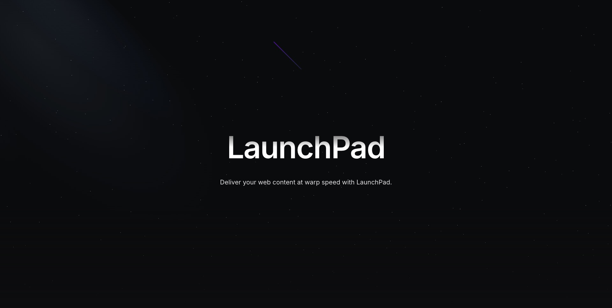

# LaunchPad - Official Strapi Demo



Welcome aboard **LaunchPad**, the official Strapi demo application, where we launch your content into the stratosphere at the speed of  *"we-can't-even-measure-it!"*.
This repository contains the following:

- A Strapi project with content-types and data already onboard
- A Next.js client that's primed and ready to fetch the content from Strapi faster than you can say "blast off!"

## 🌌 Get started

Strap yourself in! You can get started with this project on your local machine by following the instructions below, or you can [request a private instance on our website](https://strapi.io/demo)

## 🛠 Prerequisites

Before you take off, make sure you have the right env variables loaded for each part (rocket science at its best):

Strapi (example in `./strapi/.env.example`):
  - `STRAPI_ADMIN_CLIENT_URL=<url-of-nextjs>`
  - `STRAPI_ADMIN_CLIENT_PREVIEW_SECRET=<a-random-token>`

- Create a `./strapi/.env` file with these variables

Next.js (example in `./next/.env.sample`):
  - `NEXT_PUBLIC_API_URL=<url-of-strapi>` (mandatory)
  - `PREVIEW_SECRET=<the-same-random-token-as-for-strapi>`

- Create a `./next/.env` file with these variables

## 1. Clone Launchpad

To infinity and beyond! 🚀 Clone the repo with this command:

```
git clone https://github.com/strapi/launchpad.git
```

- Navigate to your project folder by running `cd launchpad`.

## 2. Start Strapi

Take a deep breath. It's time to power up the Strapi engines. Navigate to your ./my-projects/launchpad/strapi folder by running:

Navigate to your `./my-projects/launchpad/strapi` folder by running `cd strapi` from your command line.

- Run the following command in your `./launchpad/strapi` folder:

```
yarn && yarn seed && yarn develop
```

This will install dependencies, sprinkle in some data magic, and run the server. (You can run these commands separately, but why not be efficient?)

## 3. Start Next.js

We're almost ready for lift-off! Next.js is your sleek, futuristic interface for getting all that glorious content out into the world. 🚀

Navigate to your `./my-projects/launchpad/next` folder by running `cd next` from your command line.

- Run the following command in your `./launchpad/next` folder

```
yarn && yarn build && yarn start
```

This installs dependencies, builds your project, and starts your server. You’re now a spacefaring content master!

## Features Overview ✨

### User

<br />

**An intuitive, minimal editor** The editor allows you to pull in dynamic blocks of content. It’s 100% open-source, and it’s fully extensible.<br />
**Media Library** Upload images, video or any files and crop and optimize their sizes, without quality loss.<br />
**Flexible content management** Build any type of category, section, format or flow to adapt to your needs. <br />
**Sort and Filter** Built-in sorting and filtering: you can manage thousands of entries without effort.<br />
**User-friendly interface** The most user-friendly open-source interface on the market.<br />
**SEO optimized** Easily manage your SEO metadata with a repeatable field and use our Media Library to add captions, notes, and custom filenames to optimize the SEO of media assets.<br /><br />

### Global

<br />

[Customizable API](https://strapi.io/features/customizable-api): Automatically build out the schema, models, controllers for your API from the editor. Get REST or GraphQL API out of the box without writing a single line of code.<br />
[Media Library](https://strapi.io/features/media-library): The media library allows you to store your images, videos and files in your Strapi admin panel with many ways to visualize and manage them.<br />
[Role-Based Access Control (RBAC)](https://strapi.io/features/custom-roles-and-permissions): Role-Based Access Control is a feature available in the Administration Panel settings that let your team members have access rights only to the information they need.<br />
[Internationalization (i18n)](https://strapi.io/features/internationalization): Internationalization (i18n) lets you create many content versions, also called locales, in different languages and for different countries.<br />
[Audit Logs](https://strapi.io/blog/reasons-and-best-practices-for-using-audit-logs-in-your-application)The Audit Logs section provides a searchable and filterable display of all activities performed by users of the Strapi application<br />
[Data transfer](https://strapi.io/blog/importing-exporting-and-transferring-data-with-the-strapi-cli) Streams your data from one Strapi instance to another Strapi instance.<br />
[Review Worfklows](https://docs.strapi.io/user-docs/settings/review-workflows) Create and manage any desired review stages for your content, enabling your team to collaborate in the content creation flow from draft to publication. <br />


## Resources

[Docs](https://docs.strapi.io) • [Demo](https://strapi.io/demo) • [Forum](https://forum.strapi.io/) • [Discord](https://discord.strapi.io) • [Youtube](https://www.youtube.com/c/Strapi/featured) • [Strapi Design System](https://design-system.strapi.io/) • [Marketplace](https://market.strapi.io/) • [Clou Free Trial](https://cloud.strapi.io) 

## Todo

- [ ] Implement the official Strapi SEO plugin
- [ ] Implement the community Strapi preview plugin
- [ ] Create localized content for the pricing plans and products
- [ ] Populate creator fields when it'll work on Strapi 5 (article authors information are missing)

## Customization

- The Strapi application contains a custom population middleware in order to populate more data than what it is set by default. You can find it in the `./strapi/src/middlewares/deepPopulate.ts` file.

- The Strapi application contains a postinstall script that will regenerate an uuid for the project in order to get some anonymous usage information concerning this demo. You can disable it by removing the uuid inside the `./strapi/packages.json` file.

- The Strapi application contains a patch for the @strapi/admin package. It is only necessary for the hosted demos since we automatically create the Super Admin users for them when they request this demo on our website.