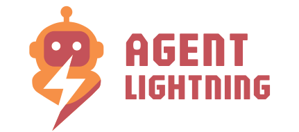
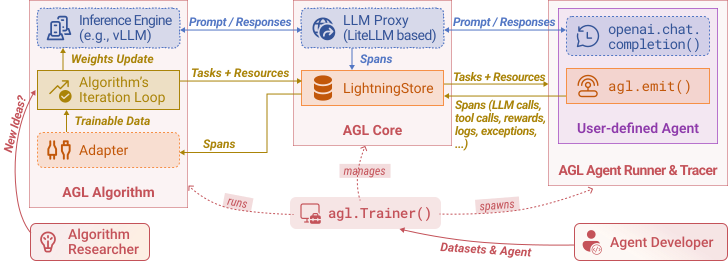

<p align="center">
  
</p>

# Agent Lightning⚡

[](https://github.com/microsoft/agent-lightning/actions/workflows/badge-unit.yml)
[](https://microsoft.github.io/agent-lightning/)
[](https://badge.fury.io/py/agentlightning)
[](LICENSE)
[](https://deepwiki.com/microsoft/agent-lightning)
[](https://discord.gg/RYk7CdvDR7)

**The absolute trainer to light up AI agents.**

Join our [Discord community](https://discord.gg/RYk7CdvDR7) to connect with other users and contributors.

## ⚡ Core Features

- Turn your agent into an optimizable beast with **ZERO CODE CHANGE** (almost)! 💤
- Build with **ANY** agent framework (LangChain, OpenAI Agent SDK, AutoGen, CrewAI, Microsoft Agent Framework...); or even WITHOUT agent framework (Python OpenAI). You name it! 🤖
- **Selectively** optimize one or more agents in a multi-agent system. 🎯
- Embraces **Algorithms** like Reinforcement Learning, Automatic Prompt Optimization, Supervised Fine-tuning and more. 🤗

Read more on our [documentation website](https://microsoft.github.io/agent-lightning/).

<p align="center">
  
</p>

## ⚡ Installation

```bash
pip install agentlightning
```

For the latest nightly build (cutting-edge features), you can install from Test PyPI:

```bash
pip install --upgrade --index-url https://test.pypi.org/simple/ --extra-index-url https://pypi.org/simple/ agentlightning
```

Please refer to our [installation guide](https://microsoft.github.io/agent-lightning/stable/tutorials/installation/) for more details.

To start using Agent-lightning, check out our [documentation](https://microsoft.github.io/agent-lightning/) and [examples](./examples).

## ⚡ Articles

- 11/4/2025 [Tuning ANY AI agent with Tinker ✕ Agent-lightning](https://medium.com/@yugez/tuning-any-ai-agent-with-tinker-agent-lightning-part-1-1d8c9a397f0e) Medium. See also [Part 2](https://medium.com/@yugez/tuning-any-ai-agent-with-tinker-agent-lightning-part-2-332c5437f0dc).
- 10/22/2025 [No More Retokenization Drift: Returning Token IDs via the OpenAI Compatible API Matters in Agent RL](https://blog.vllm.ai/2025/10/22/agent-lightning.html) vLLM blog. See also [Zhihu writeup](https://zhuanlan.zhihu.com/p/1965067274642785725).
- 8/11/2025 [Training AI Agents to Write and Self-correct SQL with Reinforcement Learning](https://medium.com/@yugez/training-ai-agents-to-write-and-self-correct-sql-with-reinforcement-learning-571ed31281ad) Medium.
- 8/5/2025 [Agent Lightning: Train ANY AI Agents with Reinforcement Learning](https://arxiv.org/abs/2508.03680) arXiv paper.
- 7/26/2025 [We discovered an approach to train any AI agent with RL, with (almost) zero code changes.](https://www.reddit.com/r/LocalLLaMA/comments/1m9m670/we_discovered_an_approach_to_train_any_ai_agent/) Reddit.
- 6/6/2025 [Agent Lightning - Microsoft Research](https://www.microsoft.com/en-us/research/project/agent-lightning/) Project page.

## ⚡ Community Projects

- [DeepWerewolf](https://github.com/af-74413592/DeepWerewolf) — A case study of agent RL training for the Chinese Werewolf game built with AgentScope and Agent Lightning.
- [AgentFlow](https://agentflow.stanford.edu/) — A modular multi-agent framework that combines planner, executor, verifier, and generator agents with the Flow-GRPO algorithm to tackle long-horizon, sparse-reward tasks.

## ⚡ Architecture

Agent Lightning keeps the moving parts to a minimum so you can focus on your idea, not the plumbing. Your agent continues to run as usual; you can still use any agent framework you like; you drop in the lightweight `agl.emit_xxx()` helper, or let the tracer collect every prompt, tool call, and reward. Those events become structured spans that flow into the LightningStore, a central hub that keeps tasks, resources, and traces in sync.

On the other side of the store sits the algorithm you choose, or write yourself. The algorithm reads spans, learns from them, and posts updated resources such as refined prompt templates or new policy weights. The Trainer ties it all together: it streams datasets to runners, ferries resources between the store and the algorithm, and updates the inference engine when improvements land. You can either stop there, or simply let the same loop keep turning.

No rewrites, no lock-in, just a clear path from first rollout to steady improvement.

<p align="center">
  
</p>

## ⚡ CI Status

| Workflow | Status |
|----------|--------|
| CPU Tests | [](https://github.com/microsoft/agent-lightning/actions/workflows/tests.yml) |
| Full Tests | [](https://github.com/microsoft/agent-lightning/actions/workflows/badge-unit.yml) |
| UI Tests | [](https://github.com/microsoft/agent-lightning/actions/workflows/dashboard.yml) |
| Examples Integration | [](https://github.com/microsoft/agent-lightning/actions/workflows/badge-examples.yml) |
| Latest Dependency Compatibility | [](https://github.com/microsoft/agent-lightning/actions/workflows/badge-latest.yml) |
| Legacy Examples Compatibility | [](https://github.com/microsoft/agent-lightning/actions/workflows/badge-compat.yml) |

## ⚡ Citation

If you find Agent Lightning useful in your research or projects, please cite our paper:

```bibtex
@misc{luo2025agentlightningtrainai,
      title={Agent Lightning: Train ANY AI Agents with Reinforcement Learning},
      author={Xufang Luo and Yuge Zhang and Zhiyuan He and Zilong Wang and Siyun Zhao and Dongsheng Li and Luna K. Qiu and Yuqing Yang},
      year={2025},
      eprint={2508.03680},
      archivePrefix={arXiv},
      primaryClass={cs.AI},
      url={https://arxiv.org/abs/2508.03680},
}
```

## ⚡ Contributing

This project welcomes contributions and suggestions. Start by reading the [Contributing Guide](docs/community/contributing.md) for environment setup, branching conventions, and pull request expectations. Most contributions require you to agree to a Contributor License Agreement (CLA) declaring that you have the right to, and actually do, grant us the rights to use your contribution. For details, visit https://cla.opensource.microsoft.com.

When you submit a pull request, a CLA bot will automatically determine whether you need to provide a CLA and decorate the PR appropriately (e.g., status check, comment). Simply follow the instructions provided by the bot. You will only need to do this once across all repos using our CLA.

This project has adopted the [Microsoft Open Source Code of Conduct](https://opensource.microsoft.com/codeofconduct/). For more information see the [Code of Conduct FAQ](https://opensource.microsoft.com/codeofconduct/faq/) or contact [opencode@microsoft.com](mailto:opencode@microsoft.com) with any additional questions or comments.

## ⚡ Trademarks

This project may contain trademarks or logos for projects, products, or services. Authorized use of Microsoft trademarks or logos is subject to and must follow [Microsoft's Trademark & Brand Guidelines](https://www.microsoft.com/en-us/legal/intellectualproperty/trademarks/usage/general). Use of Microsoft trademarks or logos in modified versions of this project must not cause confusion or imply Microsoft sponsorship. Any use of third-party trademarks or logos are subject to those third-party's policies.

## ⚡ Responsible AI

This project has been evaluated and certified to comply with the Microsoft Responsible AI Standard. The team will continue to monitor and maintain the repository, addressing any severe issues, including potential harms, if they arise.

## ⚡ License

This project is licensed under the MIT License. See the [LICENSE](LICENSE) file for details.
