# The Bird's Eye View of Agent-lightning

!!! warning "High Volume of Information Ahead"

    This article provides an in-depth exploration of the Agent-lightning architecture.
    It is not intended as a beginner’s guide or usage tutorial.

This article summarizes how Agent-lightning (as of v0.2) wires the [Algorithm][agentlightning.Algorithm], [Runner][agentlightning.Runner], and [LightningStore][agentlightning.LightningStore] loop together and shows where auxiliary components (the [Tracer][agentlightning.Tracer], [Adapter][agentlightning.Adapter], and [LLM Proxy][agentlightning.LLMProxy]) plug into the loop. Each section provides a diagram for a different perspective of the system.

## Algorithm ↔ Runner ↔ Store data flow

At its heart, Agent-lightning is built on three main components that work in a coordinated loop:

* **[Algorithm][agentlightning.Algorithm]:** The "brain" of the system. It decides what tasks to run, learns from the results, and updates resources (like AI models or prompts).
* **[Runner][agentlightning.Runner]:** The "worker" of the system. It executes tasks assigned by the algorithm, runs the agent, and records the results.
* **[LightningStore][agentlightning.LightningStore]:** The central "database" and message queue. It acts as the single source of truth, storing tasks, results, and resources, and enabling communication between the Algorithm and Runner.

The typical data flow in a training loop is as follows: The **[Algorithm][agentlightning.Algorithm]** enqueues tasks (called **[Rollouts][agentlightning.Rollout]**) into the **[LightningStore][agentlightning.LightningStore]**. A **[Runner][agentlightning.Runner]** then dequeues a task, executes it, and streams the results (called **[Spans][agentlightning.Span]**) back to the store. Once the task is complete, the algorithm can query the new data from the store to learn and update its resources.

The diagram below shows this fundamental interaction in a simple, non-parallel setup.

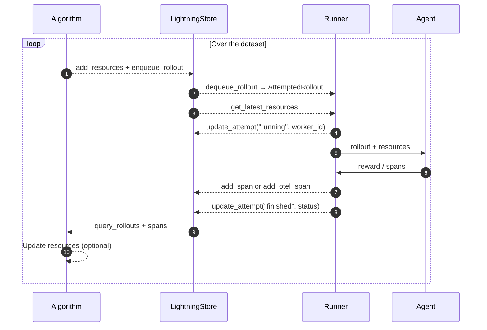

Solid lines represent direct calls, while dashed lines are asynchronous or long-running operations.

### Key Terminology

We define the following terms, which may be helpful for understanding the diagram above.

* **[Resources][agentlightning.Resource]:** A collection of assets to be tuned or trained. Agents perform rollouts against resources and collect span data. Algorithms use those data to update the resources. In RL training, the resources are a tunable model. In prompt tuning, the resources are prompt templates.
* **[Rollout][agentlightning.Rollout]:** A unit of work that an agent performs against a resource. A rollout (noun) can be incomplete, in which case it is also known as a **task**, **sample**, or **job** (these terms are used interchangeably). The agent executes its own defined workflow against the rollout — the process is also called "to rollout" (verb). After execution, the rollout (noun) is considered *complete*.
* **[Attempt][agentlightning.Attempt]:** A single execution of a rollout. One rollout can have multiple attempts in case of failures or timeouts.
* **[Span][agentlightning.Span]:** During the rollout, the agent can generate multiple spans (also known as "traces" or "events"). The recorded spans are collected in the store, which is crucial for understanding agent behavior and optimizing agents.
* **[Reward][agentlightning.emit_reward]:** A special span that is defined as a number judging the quality of the rollout during some period of the rollout.
* **[Dataset][agentlightning.Dataset]:** A collection of incomplete rollouts (i.e., tasks) for the agent to process. The dual datasets (train, val) serve as the initial input for the algorithm to enqueue the first batch of rollouts.

### Store

As discussed previously, the [LightningStore][agentlightning.LightningStore] is the central hub for all data in Agent-lightning. The store exposes a set of APIs for algorithms and runners to interact with the data; the most important ones are:

```python
from agentlightning.types import AttemptedRollout, ResourcesUpdate, Span, TaskInput

class LightningStore:

    async def enqueue_rollout(self, input: TaskInput, ...) -> Rollout: ...

    async def dequeue_rollout(self) -> AttemptedRollout | None: ...

    async def add_span(self, span: Span) -> Span: ...

    async def get_latest_resources(self) -> Optional[ResourcesUpdate]: ...

    async def wait_for_rollouts(self, rollout_ids: List[str], ...): ...

    async def query_spans(self, rollout_id: str, ...): ...

    async def update_attempt(self, rollout_id: str, attempt_id: str, status: str, ...): ...

    ...
```

These interfaces operate on [`AttemptedRollout`][agentlightning.AttemptedRollout], [`ResourcesUpdate`][agentlightning.ResourcesUpdate], [`Span`][agentlightning.Span], and [`TaskInput`][agentlightning.TaskInput] instances from `agentlightning.types`.

As the APIs show, the store essentially provides a queue for rollouts and storage for resources, spans, and attempts. Developers should implement the store carefully to ensure data integrity and consistency, especially when multiple runners work in parallel across multiple attempts.

The store is designed to be extensible. Users can implement their own store by inheriting from [`LightningStore`][agentlightning.LightningStore] and overriding methods. Agent-lightning provides a few reference implementations, such as [`InMemoryLightningStore`][agentlightning.InMemoryLightningStore] (default) and `SqliteLightningStore` (under construction). When parallelized, the store may need special wrappers to ensure thread/process safety or delegate computation to a store in another process or machine.

## Supporting Components in the Loop

While the core loop is simple, Agent-lightning provides several components to make development easier and more powerful.

### Tracer

The [`Tracer`][agentlightning.Tracer] is a component within the [`Runner`][agentlightning.Runner] that records detailed spans (events) during an agent's execution and sends them to the [`LightningStore`][agentlightning.LightningStore]. Instead of requiring the agent to manually log every span, the tracer automatically instruments key methods (e.g., LLM calls) and captures their inputs, outputs, and metadata. This provides a detailed log of the agent's behavior with minimal effort.

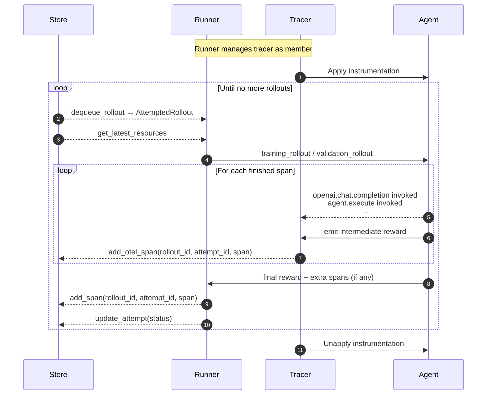

The above diagram shows the overall data flow between store, tracer and agent. In realistic, it's a bit more complicated than that. Spans are not emitted actively by the agent; they are intercepted by the tracer by hooking and instrumenting key methods used in the agents.  The tracer uses a callback (called exporter) to monitor events and log to the store. Before a rollout starts, the runner enters a [`trace_context`][agentlightning.Tracer.trace_context] before invoking the agent, wiring store identifiers into the tracer. Each span completion streams back to the store through `LightningSpanProcessor`, so the agent’s instrumentation lands in [`add_otel_span`][agentlightning.LightningStore.add_otel_span]. If the agent’s rollout method returns a numeric reward, the runner emits one more OpenTelemetry span before finalizing the attempt.

### Hooks

[`Hook`][agentlightning.Hook] implementations are user-defined callback functions that allow you to augment a [`Runner`][agentlightning.Runner]'s behavior at specific points in its lifecycle. You can use hooks to add custom logging, set up resources before a rollout begins, or tear them down after it ends. Hooks can be triggered at four key moments: `on_rollout_start`, `on_trace_start`, `on_trace_end`, and `on_rollout_end`.

Users should pay special attention to the difference between `on_trace_end` and `on_rollout_end`. The former is called right before the tracer exits the trace context, while the latter is called after the runner processes the final leftover rewards and spans, and finalizes the attempt in the store.

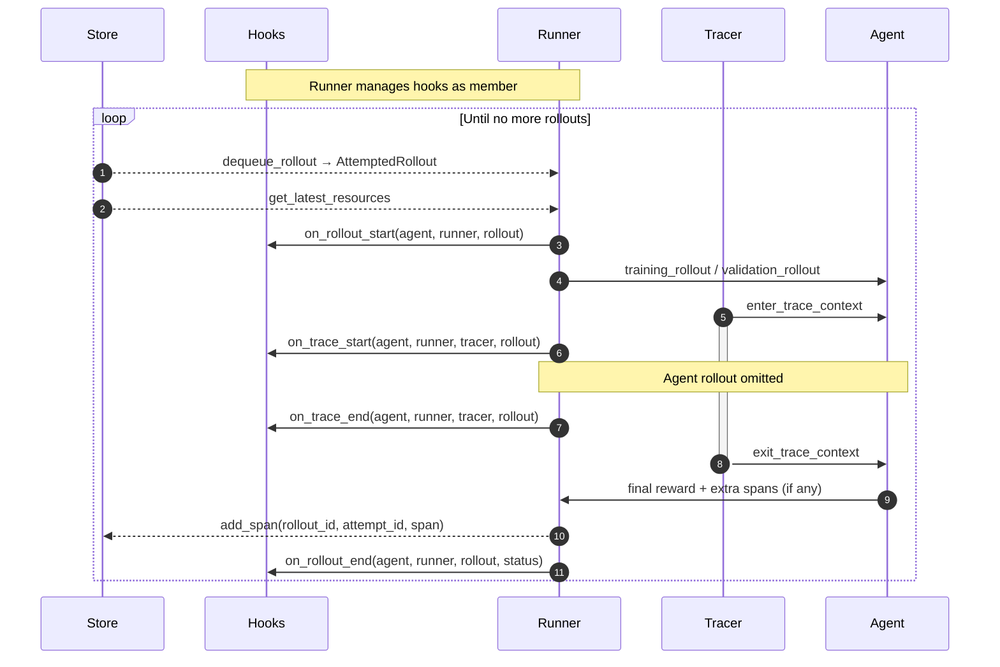

### Adapter

The [`Adapter`][agentlightning.Adapter] is a component used by the [`Algorithm`][agentlightning.Algorithm] to transform raw data from the [`LightningStore`][agentlightning.LightningStore] into a format suitable for learning. Runners stream raw spans into the store during execution. Later, the algorithm queries these spans and uses an adapter to convert them into structured data, like training examples for a reinforcement learning model.

For instance, the [`TracerTraceToTriplet`][agentlightning.TracerTraceToTriplet] processes OpenTelemetry spans to create `(prompt, response, reward)` triplets, which are the fundamental data structure for many RL fine-tuning algorithms.

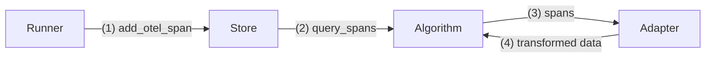

### LLM Proxy

The [`LLMProxy`][agentlightning.LLMProxy] is an optional bridge component that sits between an agent and the algorithms' resources. It acts as a centralized endpoint for all LLM calls. Usually the proxy URL is added to the store as a special resource, so that the [`Runner`][agentlightning.Runner] can fetch it along with other resources when dequeuing a rollout. During rollouts, the runner invokes the proxy's HTTP endpoint instead of calling a model backend directly.

This design offers several benefits:

1. **Instrumentation:** It automatically captures detailed traces of LLM interactions (prompts, responses, metadata) and sends them to the store, complementing the tracer, especially when the agent's code is hard to instrument directly.
2. **Backend Abstraction:** It provides a unified interface for various LLM backends (OpenAI, Anthropic, local models) and can add features like retry logic, rate limiting, and caching.
3. **Resource Management:** The algorithm can dynamically update which LLM the agent uses (e.g., swapping to a newly fine-tuned model) by simply swapping the backend model the proxy is using, without interrupting the agent's code.

The benefits above seem to be all discussed within the context of model fine-tuning. As a matter of fact, the proxy can be useful for prompt tuning as well. The algorithm can register one of the following two types of endpoints into the proxy:

1. **Endpoint served by the algorithm:** If the algorithm is internally updating the LLM weights (e.g., RL), it can launch an LLM inference engine (i.e., a model server) and register the endpoint URL with the proxy. The proxy then forwards all LLM calls to that endpoint.
2. **Third-party LLM endpoint:** If the algorithm is not updating the LLM weights (e.g., prompt tuning), it can register a third-party LLM endpoint into the proxy.

We show a diagram below that illustrates how the proxy fits into the overall data flow.

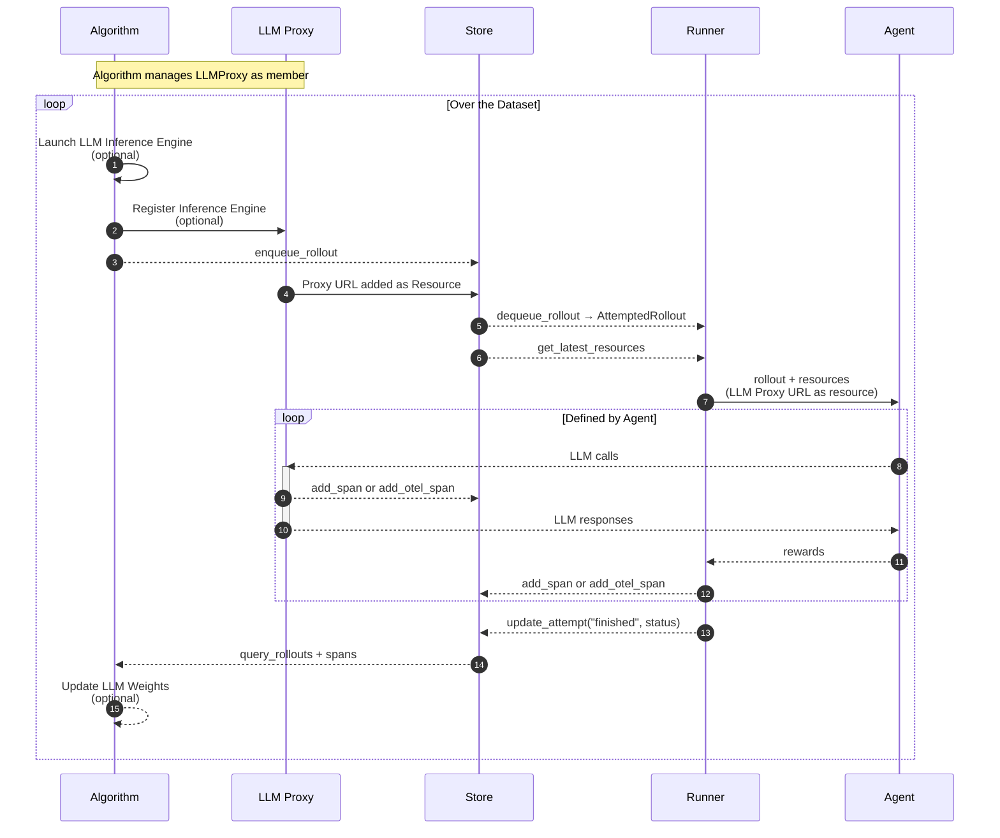

In this diagram, the store receives spans from both the proxy and the runner. We will see a problem later with parallelism where the proxy and runner are in different machines, and spans need to obtain a special counter from the store to ensure the ordering of spans.

### Trainer

The [Trainer][agentlightning.Trainer] is the high-level orchestrator that initializes and connects all major components -- [Algorithm][agentlightning.Algorithm], [Runner][agentlightning.Runner], [LightningStore][agentlightning.LightningStore], [Tracer][agentlightning.Tracer], [Adapter][agentlightning.Adapter], [LLM Proxy][agentlightning.LLMProxy], and [Hook][agentlightning.Hook]. The components can have a lifecycle as long as the trainer. The trainer manages their lifecycles and handles dependency injection, ensuring that every part of the system operates within a consistent and shared environment.

Below, we demonstrate how the components relate to each other and their roles. We first clarify the roles and relationships shown in the diagram:

1. **Owns:** components that the trainer constructs and manages directly (e.g., runner, tracer).
2. **Injects:** components passed into others as dependencies.
3. **References:** weak links for coordination without ownership.
4. **Uses:** components that are temporarily interacted with.

For example, the [LightningStore][agentlightning.LightningStore] is injected into the [Algorithm][agentlightning.Algorithm] and [Runner][agentlightning.Runner]. The [Tracer][agentlightning.Tracer] and [LitAgent][agentlightning.LitAgent] are injected into the runner. The [Adapter][agentlightning.Adapter] and [LLM Proxy][agentlightning.LLMProxy] are injected into the algorithm. The store is further injected into the tracer, adapter and LLM proxy by the runner and algorithm respectively.

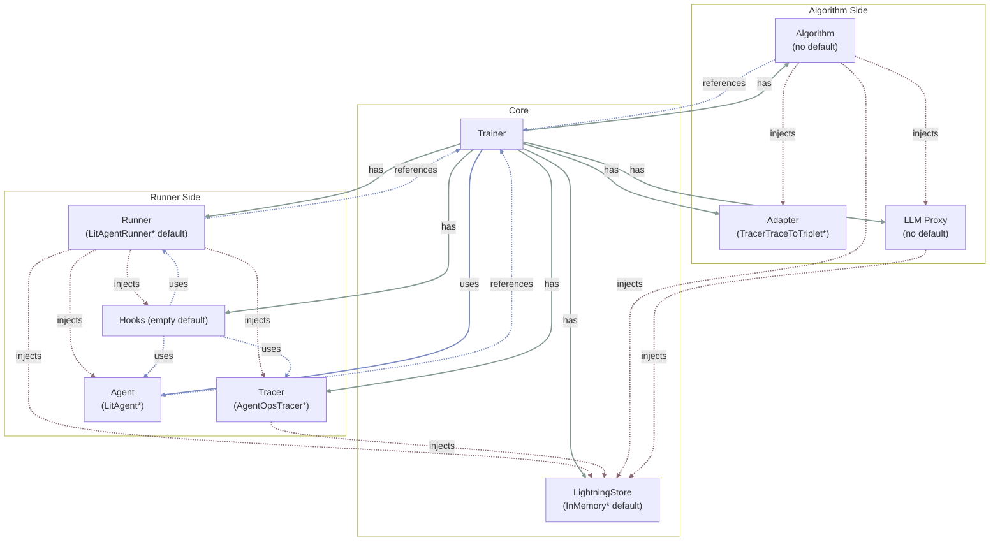

## Putting It All Together: A Reinforcement Learning Example (VERL)

[](){ #birds-eye-view-verl-example }

VERL shows how an algorithm consumes the shared infrastructure. For historical reasons, code lives in `agentlightning.algorithm.verl` and `agentlightning.verl`. The latter is legacy and reuses terms like `Trainer` in confusing ways. The former is a thin wrapper that conforms to the new algorithm interface. Future versions will merge the two.

Reinforcement learning aims to learn a policy that takes actions in states to maximize expected reward. For agents, the policy is usually a language model. Inputs are prompts (state). Outputs are generated text (action). A numeric score judges quality (reward). The `(state, action, reward)` **triplet** is the basic learning unit.

In Agent-lightning, the environment is implicit in the agent’s workflow, which orchestrates one or more LLM calls and often self-judges using rules or additional model calls. During a rollout, the agent emits spans that contain everything needed for RL training, including LLM call traces and numeric judge/reward signals. The "algorithm", on the other hand, have more responsibilities.

1. Providing a language model deployment that is currently learning and improving for the agent to interact with;
2. Preparing the tasks that the agents will perform;
3. Querying the spans generated, extracting triplets, and converting them into a format that the underlying RL library can consume;
4. Updating the language model based on the learning signals.

In the VERL integration, the algorithm launches a chat completion endpoint using `vLLM` and wraps training with `FSDP` for distributed optimization. It enqueues tasks from the dataset. After rollouts finish, it queries spans and converts them to triplets with `TracerTraceToTriplet`. VERL’s native training loop then consumes these triplets to update model weights. The workflow can be summarized in the following diagram.

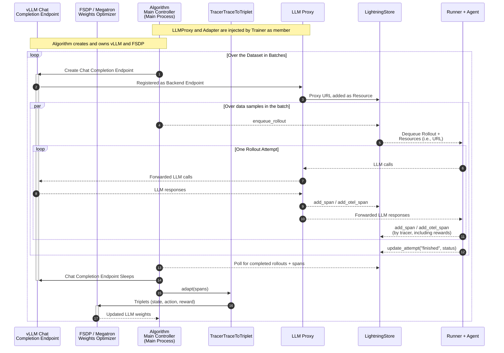

**Notes:**

1. There are interactions between different components injected into or owned by algorithms in the diagram, such as the output of the adapter feeding into the FSDP optimizer. This is for simplicity of illustration and slightly different from the actual implementation, where it's the algorithm main controller that orchestrates the data flow between components.

2. **On mapping to VERL.** VERL uses a classic RLHF setup where each action is a single token, the state is the full conversation history up to that token, and reward is given at the end. This is very different from our setup where each action is actually  a chunk of text, although they are both called RL! Therefore, after the adapter produces triplets, the algorithm converts each `(state, action, reward)` into a VERL trajectory (`DataProto`) with keys like `input_ids`, `position_ids`, `attention_mask`, and `token_level_scores`. That conversion happens after triplet generation and is not shown in the diagram.

## Execution Strategies and Parallelism

Readers might have observed from the diagram above that there is absolutely no communication between (1) runner and agents and (2) algorithm. The only overlap of them is the [Trainer][agentlightning.Trainer] and [LightningStore][agentlightning.LightningStore]. This observation is very clear with the diagram within the trainer section. This design allows us to flexibly scale the runner and algorithm independently, which is crucial for large-scale training.

Agent-lightning packages two executable bundles: a runner bundle ([Runner][agentlightning.Runner], [Tracer][agentlightning.Tracer], [Hook][agentlightning.Hook], [LitAgent][agentlightning.LitAgent]) and an algorithm bundle ([Algorithm][agentlightning.Algorithm], [Adapter][agentlightning.Adapter], [LLM Proxy][agentlightning.LLMProxy]). Both share the [LightningStore][agentlightning.LightningStore]. The trainer initializes and connects the bundles.

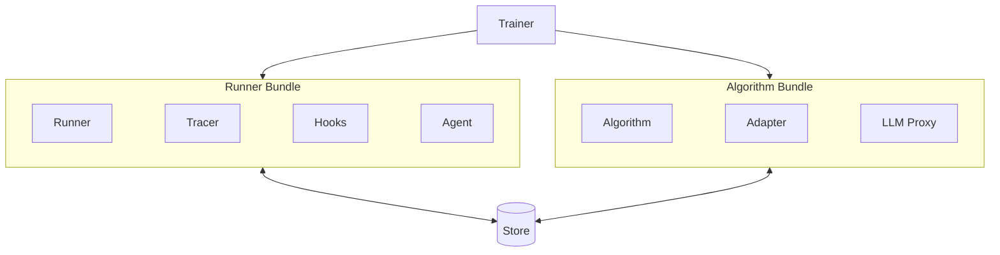

An [execution strategy][agentlightning.ExecutionStrategy], defined and owned by the trainer, governs how algorithm and runner bundles are placed, connected, scaled, and aborted. It serves four primary purposes.

Execution strategies first determine **bundle placement** — whether the two bundles run in the same thread, process, machine, or across separate machines. They also define **store management**, wrapping the store and specifying how data is shared between bundles.

In terms of **scalability**, the strategy can replicate the runner bundle across multiple threads, processes, or machines to expand throughput on the runner side. The algorithm side remains single-process due to the complexity of parallelization. Mature frameworks such as *DeepSpeed* and *Megatron* already support distributed model training, so scaling of the algorithm bundle is delegated to those implementations.

**Abort handling** is another core responsibility. Aborts may be triggered by normal exits, failures in either bundle, or user interrupts. The trainer must include cancellation interfaces for the bundles so that bundles can be cleanly aborted. When the algorithm bundle exits normally, the strategy signals the runner bundle to terminate. If the runner exits first, no signal is sent to the algorithm, as it may still be processing completed rollouts. In cases of failure or user interruption, the strategy signals both bundles to abort; if a bundle fails to respond, the strategy should attempt a forceful termination.

Agent-lightning currently provides two execution strategies: **shared-memory** and **client-server**, described in the following sections.

### Shared-memory Strategy

[`SharedMemoryExecutionStrategy`][agentlightning.SharedMemoryExecutionStrategy] runs algorithm and runner bundles as threads in one process. The strategy wraps the store with [`LightningStoreThreaded`][agentlightning.LightningStoreThreaded], which guards calls with a lock for safe concurrency.

This is good for lightweight debugging because components share one Python heap and avoid serialization. It is not suitable for heavy RL training or compute-intensive agents.

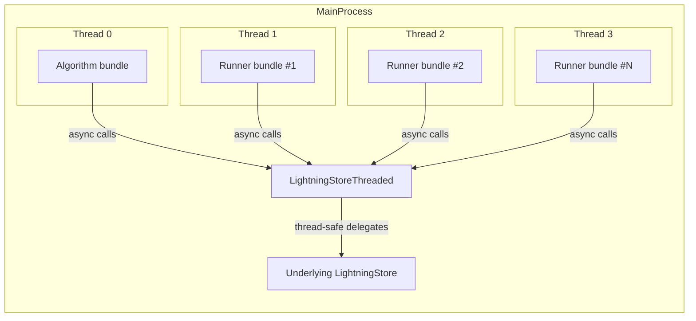

You can configure which role runs on the main thread. If the main thread runs the algorithm, it is able to spawn multiple runner threads. If it runs a runner, `n_runners` must be 1 and the runner lives on the main thread.

### Client-server Strategy

[](){ #birds-eye-view-client-server-strategy }

[`ClientServerExecutionStrategy`][agentlightning.ClientServerExecutionStrategy] splits concerns across processes. The algorithm bundle starts a [`LightningStoreServer`][agentlightning.LightningStoreServer] (HTTP API) that wraps the underlying store. Runners connect via [`LightningStoreClient`][agentlightning.LightningStoreClient] to call the same interface over REST. The server embeds a client to support algorithm-launched subprocesses (e.g., an LLM proxy worker) that need to talk back to the algorithm’s process through the same API.

Currently this design introduces an extra wrapper in the Server side (as shown in the diagram), which helps debugging and improves fault tolerance. We might revisit this design in the future and enforce the client to be the only way to communicate with the store.

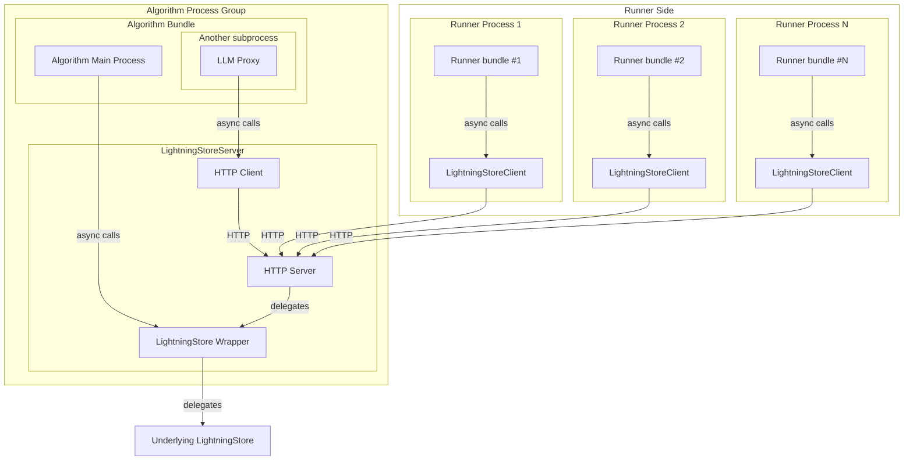

## Online/Continuous Learning

Continuous learning keeps the algorithm loop running while runners report tasks and spans opportunistically. Key differences from batch mode:

1. The algorithm does not enqueue rollouts from a fixed dataset. Runners report tasks/rollouts and spans spontaneously.
2. The algorithm can wait for rollouts with a expected set of rollout IDs, but more often polls for new rollouts and spans or waits for a count to arrive.
3. The [`Runner`][agentlightning.Runner] processes one rollout at a time via [`step(task)`][agentlightning.Runner.step] instead of exhausting a task queue. It notifies the store when starting a rollout so the store records it.
4. A user or higher-level loop controls which resources the next step uses and when to retry.

[Spans][agentlightning.Span], [Adapter][agentlightning.Adapter] implementations, and the [LLM Proxy][agentlightning.LLMProxy] work the same way.

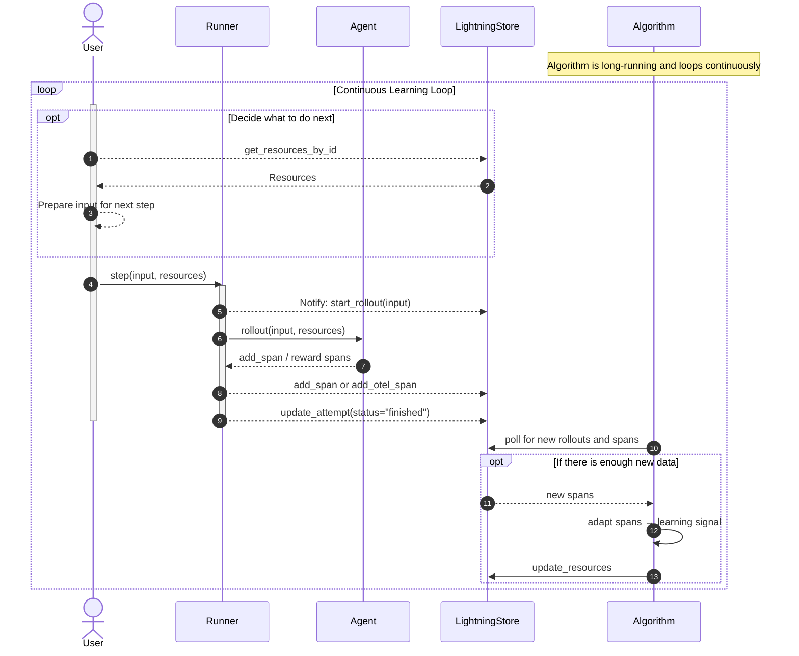
