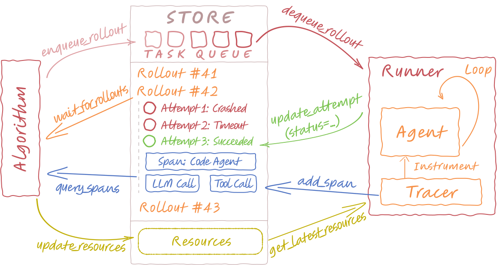
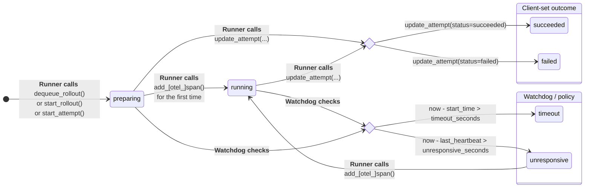

# Understanding Store

The **[`LightningStore`][agentlightning.LightningStore]** is the central coordination point for Agent-lightning. It holds the task queue, rollouts, attempts, spans, and versioned resources, and exposes a small API both Runners and Algorithms use to communicate. This document explains what’s in the store, how statuses transition, how spans are recorded, and the concurrency model (threads & processes).

## What’s in the Store?

{ .center }

At a high level:

* **Task Queue** – [`enqueue_rollout`][agentlightning.LightningStore.enqueue_rollout] adds work; workers poll with [`dequeue_rollout`][agentlightning.LightningStore.dequeue_rollout]. When a rollout is dequeued, it automatically creates a new attempt associated with itself.
* **Rollouts** – A rollout is one unit of work. It has input, metadata, links to resources, and a lifecycle (`queuing → preparing → running → ...`). Valid [RolloutStatus][agentlightning.RolloutStatus] are **`queuing`**, `preparing`, `running`, `succeeded`, `failed`, **`requeuing`**, **`cancelled`**. For algorithms and runners, the rollout can be seen as a whole, without worrying about the internal attempts.
* **Attempts** – Each rollout can have multiple executions (retries). Attempts track [`status`][agentlightning.Attempt.status], [`start_time`][agentlightning.Attempt.start_time], [`end_time`][agentlightning.Attempt.end_time], [`last_heartbeat_time`][agentlightning.Attempt.last_heartbeat_time] and link to spans. Valid [AttemptStatus][agentlightning.AttemptStatus] are `preparing`, `running`, `succeeded`, `failed`, `requeuing`, `cancelled`.
* **Spans** – Structured trace events produced by the Tracer during an attempt. Spans are ordered by a **monotonic sequence id** per `(rollout_id, attempt_id)`.
* **Resources** – Versioned, named bundles (e.g., prompt templates) referenced by rollouts.

Rollout and Task share the same surface in practice: [`Rollout.input`][agentlightning.types.Rollout] is the task input. The queue stores rollouts that are not yet running; [Runners][agentlightning.Runner] dequeue them and update the same rollout’s status as work progresses.

All [`LightningStore`][agentlightning.LightningStore] implementations must inherit from [`LightningStore`][agentlightning.LightningStore] and override the methods to implement the storage logic.

Before we look at status transitions, it helps to keep in mind that rollouts are the “outside view,” while attempts are the “inside view.” Attempts are what actually run; rollouts summarize the latest attempt plus a small set of control actions like queueing and cancellation.

## Attempt Status Transitions

The status model is intentionally small and operationally clear.



Each attempt begins in **preparing**, created either when a rollout is dequeued or explicitly started. It transitions to **running** the first time a span is recorded. From there, a few clear rules govern how it can change:

* When the runner explicitly marks completion, the attempt becomes **succeeded** or **failed** (when the runner catches exception thrown out by the agent).
* When the watchdog detects that the total elapsed time since start exceeds the configured limit, it marks the attempt as **timeout**.
* If heartbeats stop arriving for too long, the watchdog marks it **unresponsive**.
* A new span from the runner can immediately revive an **unresponsive** attempt back to **running**.

!!! info "What's a Watchdog?"

    The watchdog enforces timing and liveness rules defined by each rollout’s [`RolloutConfig`][agentlightning.RolloutConfig]. It’s not a separate thread or service, but a function periodically invoked (e.g., before store mutations) to keep attempts healthy and consistent.

This simple model allows the system to distinguish between normal termination, abnormal stalling, and recoverable interruption without additional state flags.

## Worker Telemetry

Workers track runner-level activity timestamps (`last_heartbeat_time`, `last_dequeue_time`, `last_busy_time`, `last_idle_time`) plus their current rollout assignment. Those fields are now derived automatically:

- [`dequeue_rollout(worker_id=...)`][agentlightning.LightningStore.dequeue_rollout] records which worker polled the queue and refreshes `last_dequeue_time`.
- [`update_attempt(..., worker_id=...)`][agentlightning.LightningStore.update_attempt] drives the worker status machine. Assigning an attempt marks the worker **busy** and stamps `last_busy_time`; finishing with `status in {"succeeded","failed"}` switches to **idle**, while watchdog transitions such as `timeout`/`unresponsive` make the worker **unknown** and clear `current_rollout_id` / `current_attempt_id`.
- [`update_worker(...)`][agentlightning.LightningStore.update_worker] is reserved for heartbeats. It snapshots optional `heartbeat_stats` and always updates `last_heartbeat_time`.

Because every transition flows through these APIs, worker status is derived automatically from rollout execution and heartbeats. Note, however, that calling `update_worker` with a new `worker_id` will create a new worker record with status "unknown" if one does not exist. Thus, while manual status changes are not allowed, new worker records can be created externally via heartbeats.

## Rollout Transition Map

Rollout status is an **aggregated view** of its latest attempt’s status, with additional transitions for queueing and explicit cancellation.

A rollout’s retry behavior is controlled by [`Rollout.config`][agentlightning.types.Rollout] (a [`RolloutConfig`][agentlightning.types.RolloutConfig]). The key fields are:

* [`timeout_seconds`][agentlightning.RolloutConfig.timeout_seconds] – maximum wall-clock time for an attempt before it is marked `timeout`.
* [`unresponsive_seconds`][agentlightning.RolloutConfig.unresponsive_seconds] – maximum silence between heartbeats before an attempt is marked `unresponsive`.
* [`max_attempts`][agentlightning.RolloutConfig.max_attempts] – total number of attempts allowed for the rollout (including the first).
* [`retry_condition`][agentlightning.RolloutConfig.retry_condition] – which attempt terminal statuses should trigger a retry (e.g., `["failed", "timeout", "unresponsive"]`).

**How it plays out:** The runner works on attempt `k`. If the attempt ends in a status that is listed in `retry_condition`, and `k < max_attempts`, the rollout moves to **requeuing** and the store creates attempt `k+1`. Otherwise, the rollout becomes **failed** (or **succeeded** if the runner marked it so). `timeout_seconds` and `unresponsive_seconds` are enforced by the watchdog and feed into the same decision flow.

A minimal example of how to use `RolloutConfig`:

```python
from agentlightning import RolloutConfig

# Retry on explicit failures or timeouts, up to 3 attempts in total.
cfg = RolloutConfig(
    timeout_seconds=600,
    unresponsive_seconds=120,
    max_attempts=3,
    retry_condition=["failed", "timeout"]
)

# When creating/enqueuing a rollout, attach this config.
# The store will propagate attempt outcomes according to cfg.
rollout = await store.enqueue_rollout(input, config=cfg)
```

| Latest attempt status                 | Rollout transition                        | Notes / guards                                                                                    |
| ------------------------------------- | ----------------------------------------- | ------------------------------------------------------------------------------------------------- |
| N/A                                   | `queuing`                                 | Created by `enqueue_rollout()`.                                                                   |
| `preparing`                           | `queuing/requeuing` → `preparing`         | Typically `dequeue_rollout()` or `start_rollout()`/`start_attempt()` creates a new attempt.       |
| `running`                             | `preparing/queuing/requeuing` → `running` | First `add_[otel_]span()` flips the attempt to `running`; rollout follows via `propagate_status`. |
| `succeeded`                           | `*` → `succeeded`                         | Terminal. Rollout `end_time` set.                                                                 |
| `failed` / `timeout` / `unresponsive` | `*` → `requeuing`                         | **Only if** `status ∈ retry_condition ∧ sequence_id < max_attempts`.                              |
| `failed` / `timeout` / `unresponsive` | `*` → `failed`                            | Otherwise (no retries left or retries disabled).                                                  |
| `*`                                   | `*` → `cancelled`                         | Explicitly set by `update_rollout(status=cancelled)`.                                             |

!!! note "Why aggregation?"

    In code, we use `propagate_status()` which actively updates the rollout based on the latest attempt. Reading the table above is usually easier than reverse-engineering the propagation logic in the code: think of the rollout’s transitions as *callbacks* on attempt state changes, plus queue/cancel paths.

## Spans

Every traceable operation in a rollout is stored as a [Span][agentlightning.Span]. Spans not only capture fine-grained instrumentation but also act as periodic heartbeats that demonstrate liveness. The first span marks activation; each subsequent one both extends the trace and refreshes the attempt’s [`last_heartbeat_time`][agentlightning.Attempt.last_heartbeat_time]. If no span arrives within the configured [`unresponsive_seconds`][agentlightning.RolloutConfig.unresponsive_seconds], the watchdog downgrades the attempt to **unresponsive** until activity resumes.

Spans are indexed by `(rollout_id, attempt_id, sequence_id)` where the sequence is monotonic. Tracing analysis tools like [Adapter][agentlightning.Adapter] usually rely on "time order" to reconstruct the trace. However, in a distributed system, the recorded start time and end time of a span are not necessarily in the right order when they aggregated into a central store. Therefore, we enforce every span creation to retrieve a monotonically increasing [`sequence_id`][agentlightning.Span.sequence_id] from the store before adding the span.

!!! note

    In practice, one `sequence_id` can be used to create multiple spans. In that case, the orders between the multiple spans are determined by the order of `start_time` and `end_time` of the spans.

### OpenTelemetry conversion

Runners often produce [OpenTelemetry `ReadableSpan`](https://opentelemetry.io/docs/concepts/signals/traces/#attributes) objects directly. The store normalizes them into [`Span`][agentlightning.Span] as follows:

1. The runner first requests [`get_next_span_sequence_id`][agentlightning.LightningStore.get_next_span_sequence_id] via `sequence_id = await store.get_next_span_sequence_id(rollout_id, attempt_id)`. This guarantees ordering within the attempt regardless of clock skew.
2. `trace_id`, `span_id`, `parent_id`, `name`, `status`, timestamps, attributes, events, links, and resource are copied from the OTEL span. Timestamps are auto-normalized to seconds (nanoseconds are converted).
3. OTEL `SpanContext` and parent context are preserved so downstream tools can correlate traces across systems.
4. Any additional serializable fields present on the `ReadableSpan` are retained in the stored span (after safe JSON serialization), which keeps the representation forward-compatible.

Programmatically this is encapsulated by [`Span.from_opentelemetry(readable_span, rollout_id, attempt_id, sequence_id)`][agentlightning.Span.from_opentelemetry]; [`store.add_otel_span(...)`][agentlightning.LightningStore.add_otel_span] simply wraps the fetch-then-add flow. The end result is a store span that is stable to sort, merge, and query, while still preserving the richness of the original OTEL payload.

!!! tip

    [`add_span`][agentlightning.LightningStore.add_span] or [`add_otel_span`][agentlightning.LightningStore.add_otel_span] both appends a span *and* acts as a heartbeat that can revive `unresponsive` → `running`.

## OTLP Compatibility

Some of the LightningStore implementations support exporting traces via the [OTLP/HTTP specification](https://opentelemetry.io/docs/specs/otlp/). For example, [`LightningStoreServer`][agentlightning.LightningStoreServer] exposes `/v1/traces` endpoint, it implements the binary Protobuf variant defined by the spec, including the required `Content-Type: application/x-protobuf`, optional `Content-Encoding: gzip`, and status responses encoded as `google.rpc.Status`. Agent-lightning helps parsing `ExportTraceServiceRequest` messages, validate identifiers, normalize resource metadata, and allocate sequence
numbers so store implementations only need to persist [`Span`][agentlightning.Span] objects in order.

Because the interface speaks standard OTLP, any OpenTelemetry-compatible SDK or collector can emit spans directly to a LightningStore OTLP endpoint without custom shims. The server responds according to the OTLP contract (status code, encoding, and error payloads), which keeps Agent-lightning interoperable with existing observability tooling. This compatibility serves as a strong complement to the OpenTelemetry conversion discussed above.

## Store Implementations

Currently, the only out-of-the-box implementation is [`InMemoryLightningStore`][agentlightning.InMemoryLightningStore]:

- Fast startup, zero external dependencies, and ideal for local development, CI, and unit tests.
- Fully asyncio-safe for writes; most reader operations can iterate without locks, except those that need to perform multiple queries.
- Includes a best-effort span eviction policy once memory crosses a configured watermark; querying evicted spans raises a clear error so callers can fall back.

For production you will likely want persistence. We’re actively building a SQLite-backed store that keeps the same API surface while adding durability, crash recovery, and better historical span queries. If you need something sooner, implement your own store by subclassing [`LightningStore`][agentlightning.LightningStore] and providing concrete storage for the small set of abstract methods (`enqueue_rollout`, `dequeue_rollout`, `update_attempt`, `add_span`, etc.). This document plus the tests in `tests/store/` illustrate the expected behavior.

Different store implementations may have different capabilities. For example, [`InMemoryLightningStore`][agentlightning.InMemoryLightningStore] does not support exporting traces via OTLP. Try to distinguish the capabilities of a store implementation by checking the [`capabilities`][agentlightning.LightningStore.capabilities] property.

## Thread Safety

**[`LightningStoreThreaded`][agentlightning.LightningStoreThreaded]** is a subclass of [`LightningStore`][agentlightning.LightningStore] that wraps another underlying store to make a store instance safe for multi-threaded callers. It wraps every state-mutating call in a mutex. Specifically:

* Methods like [`start_rollout`][agentlightning.LightningStore.start_rollout], [`enqueue_rollout`][agentlightning.LightningStore.enqueue_rollout], [`update_attempt`][agentlightning.LightningStore.update_attempt], [`add_span`][agentlightning.LightningStore.add_span], etc. are guarded by a lock.
* Non-mutating, potentially blocking calls remain pass-through by design (e.g., [`wait_for_rollouts`][agentlightning.LightningStore.wait_for_rollouts]), as they don’t modify shared state and should not hold the lock for long periods.

## Process Safety and Client-server Store

**[`LightningStoreServer`][agentlightning.LightningStoreServer]** wraps another underlying store and runs a FastAPI app to expose the store API over HTTP. [`LightningStoreClient`][agentlightning.LightningStoreClient] is a small [`LightningStore`][agentlightning.LightningStore] implementation that talks to the HTTP API.

!!! warning

    The server HTTP API is not considered a stable API at this moment. Users are encouraged to use the [`LightningStoreClient`][agentlightning.LightningStoreClient] to communicate with the server as a stable interface.

The server tracks the creator PID. In the owner process it delegates directly to the in-memory store; in other processes it lazily constructs a [`LightningStoreClient`][agentlightning.LightningStoreClient] to talk to the HTTP API. This prevents accidental cross-process mutation of the wrong memory image. When the server is pickled (e.g., via `multiprocessing`), only the minimal fields are serialized, but **NOT** the FastAPI/uvicorn objects. Subprocesses won’t accidentally carry live server state. Forked subprocess should also use [`LightningStoreClient`][agentlightning.LightningStoreClient] to communicate with the server in the main process.

On the client side, the client retries network/5xx failures using a small backoff, and probes `/health` between attempts. Application exceptions inside the server are wrapped as HTTP 400 with a traceback—these are **not retried**. The client also maintains a **per-event-loop** `aiohttp.ClientSession` map so that tracer callbacks (often on separate loops/threads) don’t hang by reusing a session from another loop.

Minimal lifecycle:

```python
import agentlightning as agl

# Server (owner process)
in_memory_store = agl.InMemoryLightningStore()
server = agl.LightningStoreServer(store=in_memory_store, host="0.0.0.0", port=4747)
await server.start()      # starts uvicorn in a daemon thread and waits for /health
# or keep your own event loop and stop via await server.stop()
# await server.run_forever()

# Client (same or different process)
client = agl.LightningStoreClient("http://localhost:4747")

print(await client.query_rollouts(status_in=["queuing"]))

await client.close()
await server.stop()
```

Another approach is to use a dedicated command line to start a long running server process, possibly sharable across multiple processes. In the main process, you can always use [`LightningStoreClient`][agentlightning.LightningStoreClient] to communicate with the server.

```bash
agl store --port 4747
```

!!! note

    [`LightningStoreClient.wait_for_rollouts`][agentlightning.LightningStoreClient.wait_for_rollouts] intentionally enforces a tiny timeout (≤ 0.1s) to avoid blocking event loops. Poll with short timeouts or compose with `asyncio.wait_for` at a higher layer.
