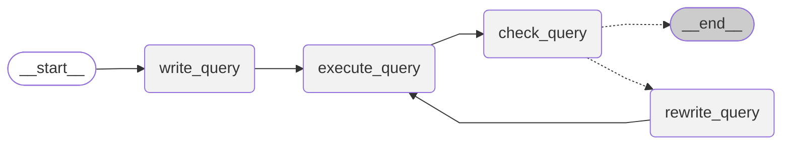

# Train SQL Agent with Agent-lightning and VERL

This walkthrough builds upon the **Agent-lightning v0.2 SQL Agent** example and explains how the system components integrate: a **LangGraph-based SQL agent** wrapped as a [`LitAgent`][agentlightning.LitAgent], the **[`VERL`][agentlightning.algorithm.verl.VERL] reinforcement learning (RL) algorithm**, and the **[`Trainer`][agentlightning.Trainer]**, which coordinates both training and debugging.

The command-line interface in [`examples/spider/train_sql_agent.py`]({{ src("examples/spider/train_sql_agent.py") }}) provides a complete runnable example. However, this document focuses on understanding the underlying architecture so you can effectively adapt the workflow to your own agents.

## SQL Agent Architecture

Agent-lightning integrates seamlessly with various orchestration frameworks, including [Agent Framework](https://github.com/microsoft/agent-framework), [AutoGen](https://github.com/microsoft/autogen), [CrewAI](https://www.crewai.com/), [LangGraph](https://github.com/langchain-ai/langgraph), and the [OpenAI Agents SDK](https://github.com/openai/openai-agents-python). It can also interoperate with custom Python logic.

In this example, **LangGraph** defines a cyclic workflow that mirrors an analyst’s iterative SQL development process. The following graph (rendered directly from [`sql_agent.py`]({{ src("examples/spider/sql_agent.py") }})) illustrates how the agent drafts, executes, critiques, and refines queries until a satisfactory result is achieved.



!!! note

    The workflow proceeds through the following stages:

    1. **write_query** – Generates an initial SQL query from the user’s question and the database schema.
    2. **execute_query** – Executes the generated query against the target database.
    3. **check_query** – Evaluates the query and its results (or errors) using a specialized prompt (`CHECK_QUERY_PROMPT`) to detect issues.
    4. **rewrite_query** – If issues are identified, the agent rewrites the query using feedback from the previous step and re-enters the loop.
    5. **END** – The cycle terminates when the query is validated or the maximum iteration count (`max_turns`) is reached. Each *turn* consists of one full loop through the `write_query`, `execute_query`, `check_query`, and (if applicable) `rewrite_query` stages.

In this tutorial, **reinforcement learning (RL)** is used to optimize the `write_query` and `rewrite_query` stages. While the `check_query` step shares the same underlying LLM weights, its trace data is not used for learning.

To keep the design modular and maintainable, it is recommended to define the LangGraph-based SQL Agent in a separate file and expose it via a builder function such as:

```python
def build_langgraph_sql_agent(
    database_path: str,
    openai_base_url: str,
    model: str,
    sampling_parameters: Dict[str, Any],
    max_turns: int,
    truncate_length: int
):
    builder = StateGraph(State)
    builder.add_node(write_query)
    ...

    builder.add_edge(START, "write_query")
    ...

    return builder.compile().graph()
```

This approach isolates your LangGraph logic from Agent-lightning version changes, improving both readability and debuggability.

## Bridging LangGraph and Agent-lightning

!!! tip

    Keep [`sql_agent.py`]({{ src("examples/spider/sql_agent.py") }}) open on the side while reading this section. This will help you understand how the code snippets shown here work in practice.

The **`LitSQLAgent`** class defined in [`sql_agent.py`]({{ src("examples/spider/sql_agent.py") }}) acts as the bridge. It subclasses [`agl.LitAgent`][agentlightning.LitAgent], allowing the runner to provision shared resources (e.g., [LLMs][agentlightning.LLM]) for each rollout.

Below is a simplified illustration of the key logic (note: this is conceptual pseudocode; the actual implementation includes dataset-specific details):

```python
class LitSQLAgent(agl.LitAgent[Dict[str, Any]]):

    def __init__(self, max_turns: int, truncate_length: int):
        # Every turn here refers to a full cycle of write/exe/check/rewrite
        self.max_turns = max_turns
        self.truncate_length = truncate_length

    def rollout(
        self,
        task: Dict[str, Any],
        resources: agl.NamedResources,
        rollout: agl.Rollout
    ) -> float | None:
        llm: agl.LLM = resources["main_llm"]
        agent = build_langgraph_sql_agent(
            database_path="sqlite:///" + task["db_id"],
            max_turns=self.max_turns,
            truncate_length=self.truncate_length,
            openai_base_url=llm.get_base_url(rollout.rollout_id, rollout.attempt.attempt_id),
            model=llm.model,
            sampling_parameters=llm.sampling_parameters,
        )
        result = agent.invoke({"question": question}, {
            "callbacks": [self.tracer.get_langchain_handler()],
            "recursion_limit": 100,
        })
        reward = evaluate_query(result["query"], ground_truth, db_path, raise_on_error=False)
        return reward
```

The `LitSQLAgent` serves as a lightweight wrapper around the LangGraph agent, providing the correct interface for the [`rollout`][agentlightning.LitAgent.rollout] method. It constructs the LangGraph agent, invokes it, and returns the evaluation result as a reward signal.

The `"main_llm"` resource key is a convention between the agent and [VERL][agentlightning.algorithm.verl.VERL]. It is used to inject an OpenAI-compatible endpoint from the [VERL][agentlightning.algorithm.verl.VERL] algorithm during rollout. Two approaches are supported to use this [agentlightning.LLM][] resource:

1. **Direct access** – Use [`llm.endpoint`][agentlightning.LLM.endpoint] for a simple integration (identical to the v0.1 example).
2. **Context-aware access** – Use [`get_base_url`][agentlightning.ProxyLLM.get_base_url] with [`rollout.rollout_id`][agentlightning.Rollout.rollout_id] and [`rollout.attempt.attempt_id`][agentlightning.Attempt.attempt_id].
   This approach enables per-caller trace attribution, improving trace collection per rollout or attempt when runner-side tracers are unavailable. For details, see [Working with Traces](../tutorials/traces.md).

## Reward Signal and Evaluation

The `evaluate_query` function provides the reward mechanism for RL training. In agent training, obtaining a consistent and meaningful reward signal is often challenging. Fortunately, this is simplified when using the [**Spider dataset**](https://yale-lily.github.io/spider). The dataset includes ~8k samples containing natural-language questions, database schemas, and ground-truth SQL queries.

Using the [**Spider evaluator**](https://github.com/taoyds/test-suite-sql-eval), the agent's generated query is executed and compared to the ground-truth query on the target database. The two queries are considered equivalent if they produce identical execution results.

!!! attention

    The ground-truth queries must **never** be exposed to the agent during training to prevent data leakage.

In this setup, the reward is returned directly from the [`rollout`][agentlightning.LitAgent.rollout] method, enabling the runner to forward it back to the RL algorithm.

!!! warning

    Avoid using [`emit_reward`][agentlightning.emit_reward] in conjunction with returning a reward value. Doing both will cause the algorithm to receive duplicate reward signals, leading to inconsistent training behavior.

## Configuring VERL for Reinforcement Learning

View [`examples/spider/train_sql_agent.py`]({{ src("examples/spider/train_sql_agent.py") }}) for a full reinforcement learning configuration, which is a plain Python dictionary. It mirrors (and actually *is*) the [shell arguments](https://verl.readthedocs.io/en/latest/index.html) used to launch training in the VERL framework but is easier to tweak programmatically:

```python
verl_config: Dict[str, Any] = {
    "algorithm": {"adv_estimator": "grpo", "use_kl_in_reward": False},
    "data": {
        # train_files and val_files are no longer needed here
        # because data are read in agl.Trainer
        ...,
        # Controls how many tasks are pooled per step
        # (multiplied by actor_rollout_ref.rollout.n)
        "train_batch_size": 32,
        # Prompt and responses larger than these lengths are truncated
        "max_prompt_length": 4096,
        "max_response_length": 2048,
    },
    "actor_rollout_ref": {
        "rollout": {
            # Only vLLM is supported currently
            "name": "vllm",
            # Equals to group size of GRPO
            "n": 4,
            # Used to enable tool call parser in vLLM
            "multi_turn": {"format": "hermes"},
            ...
        },
        "actor": {"ppo_mini_batch_size": 32, "optim": {"lr": 1e-6}, ...},
        "model": {
            # Config your preferred LLM here
            "path": "Qwen/Qwen2.5-Coder-1.5B-Instruct",
            ...
        },
    },
    "trainer": {
        "n_gpus_per_node": 1,
        # Validation once before training starts
        "val_before_train": True,
        # Validation every N training steps
        "test_freq": 32,
        # Save checkpoints every N training steps
        "save_freq": 64,
        # Go through the train dataset this many times
        "total_epochs": 2
    },
}
```

This is equivalent to the following CLI invocation:

```bash
python3 -m verl.trainer.main_ppo \
    algorithm.adv_estimator=grpo \
    algorithm.use_kl_in_reward=False \
    data.train_batch_size=32 \
    data.max_prompt_length=4096 \
    data.max_response_length=2048 \
    actor_rollout_ref.rollout.name=vllm \
    actor_rollout_ref.rollout.n=4 \
    actor_rollout_ref.rollout.multi_turn.format=hermes \
    actor_rollout_ref.actor.ppo_mini_batch_size=32 \
    actor_rollout_ref.actor.optim.lr=1e-6 \
    actor_rollout_ref.model.path=Qwen/Qwen2.5-Coder-1.5B-Instruct \
    trainer.n_gpus_per_node=1 \
    trainer.val_before_train=True \
    trainer.test_freq=32 \
    trainer.save_freq=64 \
    trainer.total_epochs=2
```

!!! warning
    We used to provide a CLI called `python -m agentlightning.verl` to launch training in v0.1. This is no longer the recommended approach. Instead, use [`agl.Trainer`][agentlightning.Trainer] to run VERL and agent runners together, or follow the [debugging tutorial](../tutorials/debug.md) if you want an isolated experience similar to v0.1.
## Orchestrating Training with [`Trainer`][agentlightning.Trainer]

[`Trainer`][agentlightning.Trainer] is the high-level orchestrator that integrates the agent, algorithm, dataset, and distributed runners. The key benefits of using the [`Trainer`][agentlightning.Trainer] are:

1. It allows you to launch everything with a single line of code: `trainer.fit(...)`.
2. It exposes configuration options such as `n_runners` to control parallelism and `adapter` to define how algorithms interpret the trace data produced by the agent.

An example usage is shown below:

```python
import agentlightning as agl

agent = LitSQLAgent()
algorithm = agl.VERL(verl_config)
trainer = agl.Trainer(
    n_runners=10,
    algorithm=algorithm,
    adapter={"agent_match": active_agent},
)
train_data = pd.read_parquet("data/train_spider.parquet").to_dict("records")
val_data = pd.read_parquet("data/test_dev_500.parquet").to_dict("records")
trainer.fit(agent, train_dataset=train_data, val_dataset=val_data)
```

First, `agl.VERL(verl_config)` launches the [`VERL`][agentlightning.algorithm.verl.VERL] algorithm and its OpenAI-compatible proxy. The `train_data` and `val_data` are passed into [`VERL`][agentlightning.algorithm.verl.VERL], which enqueues tasks to a centralized task queue managed by the [`LightningStore`][agentlightning.LightningStore], accessible to all runners.

When [`Trainer.fit`][agentlightning.Trainer.fit] is called, it launches 10 concurrent runners (as specified by `n_runners=10`). Each runner pulls tasks from the centralized task queue, executes the agent’s [`rollout`][agentlightning.LitAgent.rollout] method, collects traces, and returns rewards to VERL for training.

The [`Adapter`][agentlightning.Adapter], as discussed earlier, is used at the algorithm side, and receives the traces emitted by the agent and runners. The `agent_match` parameter ensures [`VERL`][agentlightning.algorithm.verl.VERL] only ingests spans from the specific agent you want to optimize.
In the example above, there are at least three agents—`write_query`, `rewrite_query`, and `check_query`. By setting `agent_match` to a regex like `"write"`, both `write_query` and `rewrite_query` agents are optimized simultaneously. You can also set it to `"write|check"` or `None` to include all agents if desired.

## Dry-Run the Pipeline with [`Trainer.dev`][agentlightning.Trainer.dev]

Before committing hours of GPU time, you can **dry-run** the agent with [`Trainer.dev()`][agentlightning.Trainer.dev]. This method swaps in the lightweight [`Baseline`][agentlightning.Baseline] algorithm, enqueues up to ten tasks, and prints every span emitted by the agent. Because it uses the same runner stack as full training, it’s ideal for verifying database connections and LangGraph control flow.

To begin, the agent needs a valid OpenAI-compatible endpoint since VERL is not active in this mode. You can use OpenAI’s official API or your own local LLM endpoint. Wrap it as follows:

```python
trainer = agl.Trainer(
    n_workers=1,
    initial_resources={
        "main_llm": agl.LLM(
            endpoint=os.environ["OPENAI_API_BASE"],
            model="gpt-4.1-nano",
            sampling_parameters={"temperature": 0.7},
        )
    },
)
```

Then, call [`trainer.dev(...)`][agentlightning.Trainer.dev] with a small number of tasks:

```python
dev_data = pd.read_parquet("data/test_dev_500.parquet").to_dict("records")[:10]
trainer.dev(agent, dev_dataset=dev_data)
```

Run this in a Python session or adapt your script to include a `--dev` flag. Once the spans appear healthy and the rewards are non-zero, switch back to [`trainer.fit(...)`][agentlightning.Trainer.fit] for full RL training. See the [debugging tutorial](../tutorials/debug.md) for more tips on how to debug the agent.

## Running the Sample Code

The following tutorial explains how to run the complete example in [`examples/spider`]({{ src("examples/spider") }}).

### Dataset

The trainer expects three Parquet files inside `examples/spider/data`:
`train_spider.parquet`, `test_dev_500.parquet`, and `test_dev.parquet`.

Download the curated dataset bundle provided with the repository:

```bash
cd examples/spider
pip install gdown  # included in the 'experiment' optional dependency
gdown --fuzzy https://drive.google.com/file/d/1oi9J1jZP9TyM35L85CL3qeGWl2jqlnL6/view
unzip -q spider-data.zip -d data
rm spider-data.zip
```

If you prefer to generate the files yourself, download [Spider 1.0](https://yale-lily.github.io/spider) and run:

```bash
python spider_eval/convert_dataset.py
```

Set `VERL_SPIDER_DATA_DIR` if you store the dataset outside the default `data` directory.

### Dependencies

Create a clean virtual environment, activate it, and install Agent-lightning with the VERL extras required by [this tutorial](../tutorials/installation.md). Install LangChain-related dependencies as needed.

For full training profiles, plan to use a GPU with at least **40 GB** of memory.

### Launch Training

From [`examples/spider`]({{ src("examples/spider") }}), run one of the helper scripts depending on your model preference:

```bash
python train_sql_agent.py qwen   # Default Qwen-2.5-Coder-1.5B run
python train_sql_agent.py llama  # LLaMA-3.2-1B with llama3_json tool parser
```

The script instantiates `LitSQLAgent` and launches [`trainer.fit`][agentlightning.Trainer.fit].
Provide `--active-agent my_agent_variant` if you only want to train one of the agents in the graph.

For the LLaMA profile, export an `HF_TOKEN` before running so VERL can download the model weights.

!!! tip "Troubleshooting"

    If you have got some Ray worker errors on either `WANDB_API_KEY` not set, or `HF_TOKEN` not set, or data not found, please try to restart the Ray cluster with the helper script: [scripts/restart_ray.sh]({{ src("scripts/restart_ray.sh") }}), which essentially stops the ray cluster if any, and starts a new one:

    ```bash
    env RAY_DEBUG=legacy HYDRA_FULL_ERROR=1 VLLM_USE_V1=1 ray start --head --dashboard-host=0.0.0.0
    ```

!!! note "Launching Training with NPUs"

    The example also supports running with **Huawei Ascend NPUs**. This feature is contributed by [Teams from Huawei](https://github.com/microsoft/agent-lightning/pull/272). To use it, resort to the function `config_train_npu` in the script.

    **Hardware Supported:** Atlas 200T A2 Box16, Atlas 900 A2 PODc, Atlas 800T A3. At least **a single 40GB NPU** is required to run the **Qwen2.5-Coder-1.5B-Instruct** model.

    **Environment Setup:** Python 3.11.13, CANN 8.2.RC1, torch 2.7.1+cpu, torch_npu 2.7.1.dev20250724. For basic environment preparation, please refer to this [document](https://gitcode.com/Ascend/pytorch).

    Before installing dependencies, configure the following pip mirrors:

    ```bash
    pip config set global.index-url http://repo.huaweicloud.com/repository/pypi/simple
    pip config set global.extra-index-url "https://download.pytorch.org/whl/cpu/ https://mirrors.huaweicloud.com/ascend/repos/pypi"
    ```

    Then install vLLM, vLLM-Ascend and VERL:

    ```bash
    pip install vllm==0.10.0 --trusted-host repo.huaweicloud.com
    pip install vllm-Ascend==0.10.0rc1 --trusted-host repo.huaweicloud.com
    pip install verl==0.5.0
    ```

    To ensure the VERL framework runs correctly on NPU, add the following lines to `verl/utils/vllm_utils.py`:

    ```python
    from vllm_ascend.patch import platform
    from vllm_ascend.patch import worker
    ```

    See the following reference for more details: [https://github.com/vllm-project/vllm-ascend/issues/1776](https://github.com/vllm-project/vllm-ascend/issues/1776).

    After the above dependencies have been installed, from [`examples/spider`]({{ src("examples/spider") }}) run the following script command:

    ```bash
    python train_sql_agent.py npu
    ```

### Debugging the Agent without VERL

[`sql_agent.py`]({{ src("examples/spider/sql_agent.py") }}) also provides a `debug_sql_agent()` helper to run the LangGraph workflow directly against a local or hosted OpenAI-compatible endpoint before using VERL.

Set the following environment variables, then execute the file:

```bash
export OPENAI_API_BASE=<your_api_base>
export OPENAI_API_KEY=<your_api_key>
cd examples/spider
python sql_agent.py
```

This allows you to verify that the workflow and prompts behave as expected before reinforcement learning is introduced.

### Evaluation

The following results were obtained by running `python train_sql_agent.py qwen` on a single 80 GB GPU.
Training completes in approximately **12 hours**.
The training curves below are smoothed by aggregating every 16 steps for better visualization.

Additional evaluation results were collected with a legacy version — Agent-lightning v0.1.1, `verl==0.5.0`, and `vllm==0.10.0`.
You can find them in this write-up:
[Training AI Agents to Write and Self-Correct SQL with Reinforcement Learning](https://medium.com/@yugez/training-ai-agents-to-write-and-self-correct-sql-with-reinforcement-learning-571ed31281ad)


<div style="height:400px">
<canvas data-chart='{"type": "line", "data": {"labels": [0.0, 16.0, 32.0, 48.0, 64.0, 80.0, 96.0, 112.0, 128.0, 144.0, 160.0, 176.0, 192.0, 208.0, 224.0, 240.0, 256.0, 272.0, 288.0, 304.0, 320.0, 336.0, 352.0, 368.0, 384.0, 400.0, 416.0, 432.0], "datasets": [{"label": "Training", "data": [0.4609375, 0.5041666666666667, 0.5790441176470589, 0.6015625, 0.6070772058823529, 0.6208333333333333, 0.6668198529411765, 0.66875, 0.6709558823529411, 0.6708333333333333, 0.6847426470588235, 0.6791666666666667, 0.6819852941176471, 0.690625, 0.7008272058823529, 0.7453125, 0.7398897058823529, 0.7119791666666667, 0.7224264705882353, 0.7114583333333333, 0.7431066176470589, 0.7427083333333333, 0.75, 0.7302083333333333, 0.7247242647058824, 0.7390625, 0.7463235294117647, 0.7376302083333334], "spanGaps": true}, {"label": "Validation", "data": [0.342, null, 0.594, null, 0.642, null, 0.66, null, 0.676, null, 0.676, null, 0.694, null, 0.712, null, 0.702, null, 0.678, null, 0.702, null, 0.702, null, 0.674, null, 0.734, 0.722], "spanGaps": true}]}, "options": {"interaction": {"mode": "nearest", "intersect": false}, "plugins": {"legend": {"display": true, "position": "top"}, "title": {"display": true, "text": "SQL Agent Training Result (agent_match = write)"}}, "scales": {"x": {"title": {"display": true, "text": "Step (aggregated)"}}, "y": {"title": {"display": true, "text": "Accuracy"}}}}}'></canvas>
</div>

<div style="height:400px">
<canvas data-chart='{"type": "line", "data": {"labels": [0.0, 16.0, 32.0, 48.0, 64.0, 80.0, 96.0, 112.0, 128.0, 144.0, 160.0, 176.0, 192.0, 208.0, 224.0, 240.0, 256.0, 272.0, 288.0, 304.0, 320.0, 336.0, 352.0, 368.0, 384.0, 400.0, 416.0, 432.0], "datasets": [{"label": "Training", "data": [0.4560546875, 0.578125, 0.6167279411764706, 0.6401041666666667, 0.6461397058823529, 0.6598958333333333, 0.6838235294117647, 0.69375, 0.6916360294117647, 0.6833333333333333, 0.6893382352941176, 0.6921875, 0.6838235294117647, 0.70625, 0.7045036764705882, 0.7442708333333333, 0.7288602941176471, 0.7317708333333334, 0.7311580882352942, 0.7286458333333333, 0.7316176470588235, 0.7359375, 0.7366727941176471, 0.7208333333333333, 0.7118566176470589, 0.7296875, 0.7389705882352942, 0.7350260416666666], "spanGaps": true}, {"label": "Validation", "data": [0.33, null, 0.62, null, 0.662, null, 0.682, null, 0.696, null, 0.7, null, 0.708, null, 0.692, null, 0.72, null, 0.7, null, 0.7, null, 0.702, null, 0.694, null, 0.702, 0.682], "spanGaps": true}]}, "options": {"interaction": {"mode": "nearest", "intersect": false}, "plugins": {"legend": {"display": true, "position": "top"}, "title": {"display": true, "text": "SQL Agent Training Result (agent_match = null)"}}, "scales": {"x": {"title": {"display": true, "text": "Step (aggregated)"}}, "y": {"title": {"display": true, "text": "Value"}}}}}'></canvas>
</div>
