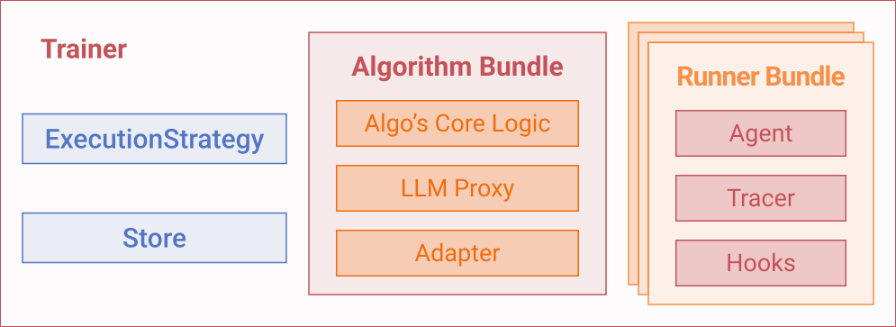

# Scaling out Algorithms and Rollouts

Agent-lightning splits training into an **algorithm bundle** and a **runner bundle** that exchange work through the [`LightningStore`][agentlightning.LightningStore]. This tutorial shows how to increase rollout throughput, place bundles across processes or machines, and keep the algorithm side scalable with external frameworks.

## Parallelizing Rollouts with [`Trainer`][agentlightning.Trainer]

Before we dive into the details of the bundles and execution strategies, let's first revisit how to parallelize rollouts with [`Trainer`][agentlightning.Trainer].

[`Trainer`][agentlightning.Trainer] is the quickest way to dial up parallelism. Even when `n_runners = 1`, calling [`Trainer.fit`][agentlightning.Trainer.fit] runs the algorithm and runners in parallel. The algorithm enqueues rollouts; runners dequeue them and execute your [`LitAgent`][agentlightning.LitAgent], and the algorithm collects spans via its [`Adapter`][agentlightning.Adapter] before scheduling the next batch.

!!! note

    One of the most important features of [`Trainer`][agentlightning.Trainer] is the ability to abort things gracefully. For example, if you press `Ctrl+C` in the terminal, the algorithm will abort and the runners will stop executing. If the algorithm crashes, the runners will also stop executing.

Increase throughput by setting `n_runners` when constructing the trainer. The following example comes from [train_calc_agent.py]({{ src("examples/calc_x/train_calc_agent.py") }}). Since backend LLMs usually use techniques like [continuous batching](https://docs.vllm.ai/en/latest/) to increase throughput, you do not have to worry about overwhelming the backend with too many requests.

```python
import agentlightning as agl
from datasets import Dataset as HFDataset
from calc_agent import calc_agent

train_dataset = HFDataset.from_parquet("data/train.parquet").to_list()
val_dataset = HFDataset.from_parquet("data/test.parquet").to_list()

algorithm = agl.VERL(verl_config)

trainer = agl.Trainer(
    algorithm=algorithm,
    n_runners=8,  # launch eight rollout workers
    tracer=agl.OtelTracer(),
    adapter=agl.LlmProxyTraceToTriplet(),
)

trainer.fit(calc_agent, train_dataset=train_dataset, val_dataset=val_dataset)
```

In [`Trainer`][agentlightning.Trainer], there are multiple other initialization parameters that you can use to customize the training process. For example, you can use `max_rollouts` to keep smoke tests short. Pass a concrete [`LightningStore`][agentlightning.LightningStore] instance when you need persistence or want to share the queue across multiple scripts.

!!! tip

    Before scaling out, run [`Trainer.dev()`][agentlightning.Trainer.dev] with `n_runners=1` to verify the rollout logic and spans without burning GPU hours.

## Bundles and Execution Strategies

When [`Trainer`][agentlightning.Trainer] starts, it packages its configuration into two callable **bundles**:



The **algorithm bundle** wraps your [`Algorithm`][agentlightning.Algorithm], adapter, and any LLM proxy into a single callable that can be aborted via a signal event.

```python
async def algorithm_bundle(store: LightningStore, event: ExecutionEvent) -> None:
    ...
```

The **runner bundle** wraps the [`Runner`][agentlightning.Runner], tracer, hooks, and agent into a single callable that can be aborted via a signal event. Unlike the algorithm bundle, the runner bundle is expected to be replicated.

```python
async def runner_bundle(store: LightningStore, worker_id: int, event: ExecutionEvent) -> None:
    ...
```

An **execution strategy** then decides where those bundles are placed (threads vs processes vs multiple machines), how many runner replicas to launch, and how lifecycle events such as shutdown are coordinated.

By default, the trainer builds an [`InMemoryLightningStore`][agentlightning.InMemoryLightningStore] if you do not provide one. Because that store has no locking or cross-process transport, the execution strategy is the component that wraps it in thread-safe or HTTP-safe facades ([`LightningStoreThreaded`][agentlightning.LightningStoreThreaded], [`LightningStoreServer`][agentlightning.LightningStoreServer]) before handing it to bundles. For a deeper look at these facades, see [Understanding the Store](../deep-dive/store.md) and [Birds' Eye View](../deep-dive/birds-eye-view.md).

Agent-lightning provides two built-in execution strategies: [`SharedMemoryExecutionStrategy`][agentlightning.SharedMemoryExecutionStrategy] and [`ClientServerExecutionStrategy`][agentlightning.ClientServerExecutionStrategy]. You can pass a string alias, a configuration dictionary, or a pre-built strategy instance:

```python
import agentlightning as agl

algorithm = agl.Baseline()

# Short alias for the shared-memory strategy.
# Because the runner lives on the main thread in this mode,
# n_runners must be 1 unless you move the algorithm to the main thread.
trainer = agl.Trainer(algorithm=algorithm, n_runners=1, strategy="shm")

# Dict with overrides; keep the algorithm on the main thread so multiple runner threads can spawn.
# Specifying `n_runners` inside strategy is equivalent to passing `n_runners` to the trainer.
trainer = agl.Trainer(
    algorithm=algorithm,
    strategy={
        "type": "shm",
        "n_runners": 8,
        "main_thread": "algorithm",
    },
)

# Pass an existing strategy instance – Trainer respects the strategy's own `n_runners`.
strategy = agl.SharedMemoryExecutionStrategy(main_thread="algorithm", n_runners=4)
trainer = agl.Trainer(algorithm=algorithm, strategy=strategy)
```

If you omit the strategy, the trainer defaults to `ClientServerExecutionStrategy(n_runners=trainer.n_runners)`. You can still re-specify the client-server strategy through aliases or configuration to tweak ports and other settings:

```python
trainer = agl.Trainer(
    algorithm=algorithm,
    n_runners=8,
    strategy={"type": "cs", "server_port": 9999},
)
```

Environment variables give you another layer of control. For example:

```python
import os

os.environ["AGL_SERVER_PORT"] = "10000"
os.environ["AGL_CURRENT_ROLE"] = "algorithm"
os.environ["AGL_MANAGED_STORE"] = "0"

trainer = agl.Trainer(algorithm=algorithm, n_runners=8, strategy="cs")
```

The resulting [`ClientServerExecutionStrategy`][agentlightning.ClientServerExecutionStrategy] picks up the port, role, and managed-store flag from the environment.

!!! tip

    The same configuration patterns apply to other trainer components. For example,
    ```python
    trainer = agl.Trainer(algorithm=algorithm, tracer=agl.OtelTracer())
    ```
    wires in a custom tracer, while
    ```python
    trainer = agl.Trainer(algorithm=algorithm, adapter="agentlightning.adapter.TraceToMessages")
    ```
    swaps in a different adapter. Passing a dict lets you tweak the init parameters of defaults without naming the class explicitly:

    ```python
    trainer = agl.Trainer(
        algorithm=algorithm,
        adapter={"agent_match": "plan_agent", "repair_hierarchy": False},
    )
    ```

The next sections walk through the two built-in strategies and how they affect placement and store access.

## Client-server Architecture

The default [`ClientServerExecutionStrategy`][agentlightning.ClientServerExecutionStrategy] starts a [`LightningStoreServer`][agentlightning.LightningStoreServer] alongside the algorithm and spawns runner processes that talk to it through [`LightningStoreClient`][agentlightning.LightningStoreClient]. All runners share the HTTP endpoint, so the queue and spans stay consistent across processes or machines.

If you simply instantiate [`Trainer`][agentlightning.Trainer] (as above), it will send the algorithm bundle and runner bundle to [`ClientServerExecutionStrategy`][agentlightning.ClientServerExecutionStrategy], which will then:

1. Launch \(N+1\) processes: \(N\) runner processes and 1 algorithm process (one of them could live in the main process).
2. The algorithm process will take the store received from [`Trainer`][agentlightning.Trainer], wrap it in a [`LightningStoreServer`][agentlightning.LightningStoreServer], and start serving it over HTTP.
3. The runner processes discard the store and create a new store, which is a client that connects to the algorithm process through [`LightningStoreClient`][agentlightning.LightningStoreClient], and start executing the runner bundle.
4. The strategy automatically escalates shutdown (cooperative stop → `SIGINT` → `terminate()` → `kill()`) so long-running runners do not linger.

You can override server placement or ports, and whether to automatically wrap the store, through constructor arguments or environment variables:

```python
trainer = agl.Trainer(
    algorithm=algorithm,
    n_runners=1,
    strategy={
        "type": "cs",
        "server_host": "0.0.0.0",
        "server_port": 9999,
        "main_process": "runner",
    },
)
```

Set `AGL_SERVER_HOST` and `AGL_SERVER_PORT` if you prefer environment-based configuration. You can also use `AGL_MANAGED_STORE` if you do not want the execution strategy to wrap the store for you. An example is shown in [Debugging with External Store][debug-with-external-store].

Algorithms sometimes require heterogeneous computation resources, such as GPU accelerators, while runners sometimes require a specific environment to run because many agent frameworks are fragile in their dependencies. A role-based launch pattern helps you place the algorithm on a dedicated machine with more GPU memory, while runners can live on another machine with more flexible dependencies. This is possible via `AGL_CURRENT_ROLE="algorithm"` or `AGL_CURRENT_ROLE="runner"` environment variables. When running on different machines, you also need to set `AGL_SERVER_HOST` and `AGL_SERVER_PORT` to the IP address and port of the algorithm machine. You might recognize that this convention is very similar to `MASTER_ADDR` and `MASTER_PORT` in [PyTorch distributed training](https://docs.pytorch.org/docs/stable/notes/ddp.html).

### Launching Algorithm and Runner Roles on Separate Machines

When you want to stretch the algorithm onto a GPU-rich machine and keep rollout workers close to the data source (or on machines with a more permissive dependency stack), launch the same training script in different terminals with role-specific environment variables. The client–server strategy will route each process to the right side of the queue as long as they share the same `AGL_SERVER_HOST`/`AGL_SERVER_PORT` pair.

**1. Pick an address and port for the store.** Decide which machine will host the algorithm. Choose a TCP port that can be reached by the runner machines (for example, open it in your firewall configuration). In this example we will use `10.0.0.4:4747`.

**2. Start the algorithm process.** On the machine that should run the algorithm, expose the store by binding to all network interfaces and mark the role as `algorithm`.

```bash
export AGL_SERVER_HOST=0.0.0.0
export AGL_SERVER_PORT=4747
export AGL_CURRENT_ROLE=algorithm

python train_calc_agent.py
```

Leaving `AGL_MANAGED_STORE` unset (or setting it to `1`) lets the strategy create the [`LightningStoreServer`][agentlightning.LightningStoreServer] for you. Otherwise, you can use the method in the previous section to create a store on your own.

**3. Start rollout workers on remote machines.** Every runner machine should point to the algorithm host and declare itself as the `runner` role. You can start multiple processes per machine or repeat the command on additional hosts.

```bash
export AGL_SERVER_HOST=10.0.0.4
export AGL_SERVER_PORT=4747
export AGL_CURRENT_ROLE=runner
python train_calc_agent.py --n-runners 4
```

The runner process automatically connects via [`LightningStoreClient`][agentlightning.LightningStoreClient]. Adjust `--n-runners` to spawn the desired number of worker processes on that machine.

**4. Scale out as needed.** Repeat step 3 on as many machines as you need. When you are done, stop the algorithm process. However, since the runners are on different machines, the strategy WILL NOT send a cooperative stop signal to the connected runners. So you need to kill the runners on your own.

This role-based launch mirrors what [`Trainer.fit`][agentlightning.Trainer.fit] does inside a single machine while letting you spread work across a fleet. Because every process shares the same training script, you keep a single source of truth for dataset loading, adapters, and tracers, but you can tune compute resources independently for the algorithm and rollout workers.

### Shared-memory Strategy

[`SharedMemoryExecutionStrategy`][agentlightning.SharedMemoryExecutionStrategy] keeps everything inside one process. The runner runs on the main thread (by default) while the algorithm lives on a Python thread guarded by [`LightningStoreThreaded`][agentlightning.LightningStoreThreaded].

Use it when you want easier debugging with shared breakpoints and no serialization overhead, or minimal startup time for unit tests. It's not a good choice for many algorithms that require heavy model training because [`LightningStoreThreaded`][agentlightning.LightningStoreThreaded] does not work for multiprocessing. Using it with multiprocessing algorithms will lead to undefined behavior.

Sample configuration:

```python
trainer = agl.Trainer(
    algorithm=algorithm,
    strategy="shm",
)
```

You can further customize the init parameters of [`SharedMemoryExecutionStrategy`][agentlightning.SharedMemoryExecutionStrategy]. With `main_thread="runner"`, the runner occupies the main thread and `n_runners` must be `1`. The strategy respects `AGL_MANAGED_STORE`; set it to `0` to opt out of the `LightningStoreThreaded` wrapper.

## Parallelizing Algorithms

Runner parallelism scales rollout throughput, but the algorithm loop remains a single-process loop inside the execution strategy. We understand that many algorithms have parallelization built in, but that's outside the parallelization scope of Agent-lightning.

Agent-lightning strives to make algorithms’ own parallelization work well under our execution strategies. The biggest challenge turns out to come from the store. For example, [`VERL`][agentlightning.algorithm.verl.VERL] uses [Ray](https://www.ray.io/) and launches [FSDP](https://docs.pytorch.org/tutorials/intermediate/FSDP_tutorial.html) and [vLLM](https://vllm.ai/) components internally. [`ClientServerExecutionStrategy`][agentlightning.ClientServerExecutionStrategy] has to make sure that the server is not simultaneously serving in multiple processes or Ray workers, and that there is only one single authoritative source of truth for all subprocesses to connect to. Subprocesses connect to the store via a small [`LightningStoreClient`][agentlightning.LightningStoreClient] bundled within [`LightningStoreServer`][agentlightning.LightningStoreServer].

!!! note

    The [birds' eye view][birds-eye-view-client-server-strategy] illustrates how adapters, proxies, and stores interact when the algorithm spawns additional workers. Use that diagram as a checklist when introducing new distributed components.
