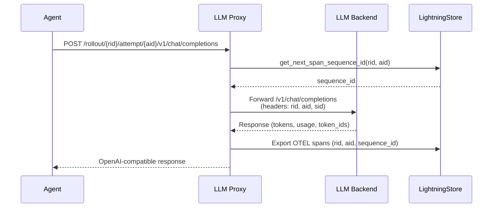

# Working with Traces

Tracing is the secret capability that lets Agent-lightning train almost any agent without rewriting its core logic. The idea was born in observability tooling inside LLMOps workflows and, in Agent-lightning, evolved into a first-class primitive inside the learning loop. Beyond helping you understand what happened inside a rollout, traces provide reward spans and other learning signals that power reinforcement learning and fine-tuning algorithms.


Agent-lightning stores every recorded operation as a [`Span`][agentlightning.Span] inside a [`LightningStore`][agentlightning.LightningStore]. The naming comes from [OpenTelemetry spans](https://opentelemetry.io/docs/concepts/signals/traces/), shown in the screenshot above. A span can represent an LLM call, a tool invocation, a graph edge, an explicit reward emission, or an arbitrary Python code block. Spans form a tree where parent spans describe higher-level steps and children record the detailed work. The sections below walk through how spans are produced and how to interpret them once they reach the store.

## Writing Spans

Most [`Runner`][agentlightning.Runner] implementations wire a [`Tracer`][agentlightning.Tracer] into the agent’s lifecycle. The tracer is responsible for installing instrumentation, buffering OpenTelemetry spans, and committing them to the [`LightningStore`][agentlightning.LightningStore]. When a runner executes a rollout, it allocates a store-backed tracing context:

```python
async with tracer.trace_context(
    name="my-rollout",
    store=store,
    rollout_id=rollout.rollout_id,
    attempt_id=attempt.attempt_id,
):
    await run_agent_logic()
```

The context manager then requests sequence numbers from the store, converts OpenTelemetry spans into [`Span`][agentlightning.Span] objects, and persists them in the middle or at the end of the attempt, depending on the tracer implementation. Agent-lightning ships two tracers out of the box; both rely on [OpenTelemetry Traces](https://opentelemetry.io/docs/concepts/signals/traces/) and ignore metrics or logs.

!!! tip "What's instrumentation?"

    In simple terms, *instrumentation* means adding "patches" or hooks inside your code so you can observe what it’s doing while it runs. Think of it like putting flight recorders in an airplane — instrumentation records key actions, inputs, outputs, and timings without changing how the code behaves. In Agent-lightning tracers, this instrumentation automatically creates spans (small, structured records of work) that show what each part of an agent did, how long it took, and how different steps connect together.

### AgentOps Tracer

[`AgentOpsTracer`][agentlightning.AgentOpsTracer] will be the default tracer when [`Trainer`][agentlightning.Trainer] is used but no tracer is explicitly specified. It bootstraps the [AgentOps SDK](https://www.agentops.ai/) locally, installs the supplied instrumentation hooks (LangChain, LangGraph, LiteLLM, FastAPI, and others) provided by the [AgentOps Python SDK](https://github.com/AgentOps-AI/agentops), and forwards everything through a local OpenTelemetry [`TracerProvider`](https://opentelemetry.io/docs/specs/otel/trace/api/). [`AgentOpsTracer`][agentlightning.AgentOpsTracer] never calls the hosted AgentOps service; instead, it attaches a `LightningSpanProcessor` implemented by the Agent-lightning team so that spans are captured and shipped straight into the store.

Because it shares the AgentOps instrumentation surface, any framework supported by AgentOps automatically gains tracing in Agent-lightning. We layer additional hooks on top of AgentOps to capture features that the SDK misses today:

1. Certain providers emit extra metadata — for example, [token IDs returned by vLLM](../deep-dive/serving-llm.md) — that are not recorded by the stock SDK. We augment those spans with the missing payloads.
2. AgentOps constructs parent-child relationships on a best-effort basis, but mixed instrumentation (for example, OpenAI Agent SDK alongside direct OpenAI Chat Completion calls) can leave segments disconnected. Our implementation (actually implemented in the [`TracerTraceToTriplet`][agentlightning.TracerTraceToTriplet] adapter) repairs those relationships when the hierarchy can be inferred from rollout context.
3. Some versions of downstream frameworks simply do not emit spans for critical events (LangGraph node entrances are a common example). The tracer installs lightweight shims so those spans appear consistently.

If a vendor integration behaves unexpectedly, users are encouraged to combine the tracer with [Hooks](./debug.md) to inspect the raw spans or diagnostics, and/or implement a specialized tracer for the framework in question.

### OpenTelemetry Tracer

[`OtelTracer`][agentlightning.OtelTracer] is a minimal implementation that initializes a vanilla [`TracerProvider`](https://opentelemetry.io/docs/specs/otel/trace/api/) and gives you direct control over span creation through the standard `opentelemetry.trace` API. Use it when you already have explicit instrumentation in your agent, when the AgentOps SDK does not support your framework, or when you want to emit custom spans from business logic.

!!! note

    [Microsoft Agent Framework](https://github.com/microsoft/agent-framework) is a typical example with built-in OpenTelemetry support. Once you set `OBSERVABILITY_SETTINGS.enable_otel = True`, the framework will automatically emit OpenTelemetry spans, and [`OtelTracer`][agentlightning.OtelTracer] will be able to capture them. No extra instrumentation is needed.

Inside your agent you can call `opentelemetry.trace.get_trace_provider().get_tracer("my-agent")` and use that tracer to [create spans](https://opentelemetry.io/docs/languages/python/cookbook/) exactly as you would in any OpenTelemetry application. The Lightning span processor attached by [`OtelTracer`][agentlightning.OtelTracer] guarantees that every span is sequenced, converted, and written to the store. The same applies for emitted rewards ([`emit_reward`][agentlightning.emit_reward]) and other emitter signals, which are just a special case of manually-created spans.

### LLM Proxy

Sometimes the runner can’t observe the agent directly — because it’s in another language or running remotely. [`LLMProxy`][agentlightning.LLMProxy] bridges that gap by instrumenting the server side of LLM calls. It wraps [LiteLLM](https://docs.litellm.ai/) and adds middleware that accepts prefixed routes like `/rollout/{rid}/attempt/{aid}/v1/chat/completions`. Before forwarding, the middleware rewrites the path to `/v1/chat/completions`, fetches a monotonic `sequence_id` from the `LightningStore`, injects `x-rollout-id`, `x-attempt-id`, and `x-sequence-id` into the request headers, and then forwards the request to the backend LLM endpoint.

LiteLLM produces OpenTelemetry spans for the request/response. A custom `LightningSpanExporter` reads the rollout/attempt/sequence identifiers from the recorded request headers and persists each span to the store. Because the `sequence_id` is allocated at the start of the request, traces stay in strict order even across machines with skewed clocks or asynchronous responses.



[`LLMProxy`][agentlightning.LLMProxy] actually provides more functionalities than just the middleware for tracing. Read [Serving LLM](../deep-dive/serving-llm.md) for more details.

[](){ #distributed-tracing }

!!! note "Distributed Tracing"

    Agent-lightning enforces deterministic span ordering by assigning a monotonic [`sequence_id`][agentlightning.Span.sequence_id] to every span within an attempt. Before calling [`LightningStore.add_span`][agentlightning.LightningStore.add_span] or [`LightningStore.add_otel_span`][agentlightning.LightningStore.add_otel_span], tracers are expected to call [`LightningStore.get_next_span_sequence_id`][agentlightning.LightningStore.get_next_span_sequence_id] to get the next sequence id. This removes clock skew and merges spans produced on different machines or threads. If you implement a custom tracer or exporter, make sure you do this (or respect the one provided in headers by components such as [`LLMProxy`][agentlightning.LLMProxy]); otherwise, adapters will struggle to properly reconstruct the execution tree.

### Custom Tracer

If none of the built-in tracers fit your environment, the first option to consider is to [return the spans](./write-agents.md) directly from your agent implementation. If that's not possible, or you want to support multiple agents in a unified effort, you can implement your own tracer by subclassing [`Tracer`][agentlightning.Tracer].

Custom tracers must implement at least [`trace_context`][agentlightning.Tracer.trace_context]. The [`trace_context`][agentlightning.Tracer.trace_context] coroutine should install or activate whatever instrumentation you need, then yield a span processor that ultimately adds spans to the store. You can reuse the `LightningSpanProcessor` if you produce OpenTelemetry `ReadableSpan` objects, or call [`LightningStore.add_span`][agentlightning.LightningStore.add_span] directly if you generate [`Span`][agentlightning.Span] instances yourself.

Advanced tracers often run auxiliary services (for example, starting a telemetry daemon or attaching to a container runtime) inside `init_worker` and tear them down in `teardown_worker`. The [`ParallelWorkerBase`][agentlightning.ParallelWorkerBase] lifecycle that `Tracer` inherits from ensures those hooks are executed in every runner subprocess.

## Reading Traces

Generally, there are two approaches to reading traces. When you only need a quick look, [`Tracer.get_last_trace`][agentlightning.Tracer.get_last_trace] returns the raw OpenTelemetry spans captured most recently. For historical analysis, use the [`LightningStore.query_spans`][agentlightning.LightningStore.query_spans] API, which yields normalized [`Span`][agentlightning.Span] objects keyed by rollout ID and attempt ID. Combine those queries with [`LightningStore.query_rollouts`][agentlightning.LightningStore.query_rollouts] to align spans with rollout status, retries, and timing information.

Spans arrive asynchronously, originate from different processes, and form hierarchies rather than simple lists. The attributes of each span are tedious and unfriendly to human readers. This combination makes raw traces time-consuming to inspect, especially when you only care about specific signals such as rewards, LLM prompts, responses, or tool outputs. Understanding how the store exposes traces and how adapters reshape them will save hours when debugging or training.

!!! note "Why traces can be difficult to read?"

    The trace tree for a single rollout typically mixes multiple abstraction layers: a planner span may contain several LLM spans, each of which contains tool execution spans that can themselves trigger nested agent invocations. There are also instrumentations at different levels. For example, when a request delegates to another library (e.g., from LangChain to OpenAI), two libraries might emit spans for the same request. At the top level, there could be concurrently running agents that may flush spans slightly out of order. Sorting by `sequence_id` restores the chronological view, but interpreting the tree requires additional context about parent-child relationships and rollout metadata.

### Adapter

[Adapters][agentlightning.Adapter] transform lists of spans into higher-level data structures that training algorithms can consume directly. Agent-lightning provides several adapters out of the box:

* [`TracerTraceToTriplet`][agentlightning.TracerTraceToTriplet] converts spans into `(prompt, response, reward)` triplets, which power reinforcement-learning algorithms such as [VERL](../algorithm-zoo/verl.md) and connect trace data to gradient updates.
* [`TraceToMessages`][agentlightning.TraceToMessages] rewrites spans into OpenAI chat message JSON suitable for supervised fine-tuning or evaluation harnesses.
* [`LlmProxyTraceToTriplet`][agentlightning.LlmProxyTraceToTriplet] mirrors [`TracerTraceToTriplet`][agentlightning.TracerTraceToTriplet] but understands spans emitted by [LLMProxy][agentlightning.LLMProxy]. It is experimental and might be merged with [`TracerTraceToTriplet`][agentlightning.TracerTraceToTriplet] in the future.

Adapters are regular Python callable instances, so you can plug them into [`Trainer`][agentlightning.Trainer] via the `adapter` argument, or call them manually during exploration. When used in [`Trainer`][agentlightning.Trainer], adapters are bundled into the [`Algorithm`][agentlightning.Algorithm] before the algorithm runs, through the [`Algorithm.set_adapter`][agentlightning.Algorithm.set_adapter] method.

You can also customize an [`Adapter`][agentlightning.Adapter] by extending the implementations above or subclassing the base class. If you need a bespoke format, subclass [`TraceAdapter`][agentlightning.TraceAdapter] (for store spans) or [`OtelTraceAdapter`][agentlightning.OtelTraceAdapter] (for raw OpenTelemetry spans) and implement `adapt` (these two classes can usually share the same implementation).

### Reading Rewards

Rewards are recorded as dedicated spans named [`agentlightning.reward`][agentlightning.SpanNames.REWARD]. Emitting a reward through [`emit_reward`][agentlightning.emit_reward] or the [`@reward` decorator][agentlightning.reward.reward] ensures the value is stored in the span’s `attributes["reward"]`. To audit rewards, fetch spans from the store and use the helper utilities in [`agentlightning.emitter`](../reference/agent.md):

```python
from agentlightning.emitter import find_final_reward

spans = await store.query_spans(rollout_id)
reward = find_final_reward(spans)
print(f"Final reward: {reward}")
```

[`find_reward_spans`][agentlightning.find_reward_spans] returns every reward span so you can visualize intermediate shaping signals, while [`find_final_reward`][agentlightning.find_final_reward] extracts the last non-null reward per attempt. While these helpers are convenient, they may not help you fully understand the chronological or hierarchical relationships between reward spans and other spans. Using an [`Adapter`][agentlightning.Adapter] — especially the same one used in the algorithm you’re working with — remains the recommended way to inspect your generated spans.
