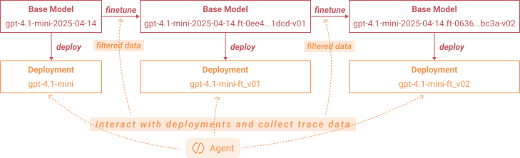

# Supervised Fine-tuning with Azure OpenAI

This example walks through an end-to-end supervised fine-tuning loop on Azure OpenAI. The trainer runs a toy capital-lookup agent, collects traces with rewards, submits fine-tuning jobs using those traces, and deploys every successful checkpoint as a new Azure OpenAI deployment.

**NOTE: The example is tested and compatible with Agent-lightning v0.2.x, but it's not yet maintained on CI due to the difficulty of maintaining a logged-in status in the testing environment.**

## Prerequisites

You need an Azure subscription with an Azure OpenAI resource that supports fine-tuning in your region and a base deployment you can reuse (the defaults assume `gpt-4.1-mini` backed by `gpt-4.1-mini-2025-04-14`). Sign in with the Azure CLI (`az login`) and install the project dependencies, for example via `uv sync` from the repository root.

## Setup

Copy the sample environment file `.env.example`, fill in your Azure values, and source it before running any scripts:

```bash
cp examples/azure_finetune/.env.example examples/azure_finetune/.env
# edit examples/azure_finetune/.env with your keys and identifiers
source examples/azure_finetune/.env
```

Confirm that you have successfully logged into Azure with:

```bash
az account show
```

## Included Files

| File | Description |
| --- | --- |
| `aoai_finetune.py` | Fine-tuning algorithm that batches rollouts, filters traces, launches jobs, deploys checkpoints, and evaluates them. |
| `train_capital_agent.py` | Trainer entry point that loads `capital_samples.csv` and orchestrates three fine-tuning iterations. |
| `capital_agent.py` | Tool-enabled agent that calls `country_capital_lookup`, producing reward `1.0` when the response contains the expected capital. |
| `capital_samples.csv` | Prompt/answer pairs that the trainer splits 80/20 into training and validation sets. |
| `tests/test_deployment.py` | Smoke tests for deployment helper methods when live Azure credentials are configured. |

## Workflow Overview

- **Stage 1 – Collect traces.** `Trainer` points runners at your base deployment and gathers rollouts in batches of `finetune_every_n_rollouts`.
- **Stage 2 – Filter and package data.** Rewards and telemetries from `capital_agent` are collected by Agent-lightning, which drives filtering via `data_filter_ratio`, and the remaining traces are serialized into Azure OpenAI JSONL format.
- **Stage 3 – Fine-tune.** `AzureOpenAIFinetune.finetune` uploads the dataset, waits for the fine-tuning job to finish, and returns the new base model identifier.
- **Stage 4 – Deploy and evaluate.** A versioned deployment such as `gpt-4.1-mini-ft_v01` is created, old deployments are pruned when `max_deployments` is exceeded, and validation rollouts confirm the reward.

The process is shown in the following diagram:

<p align="center">
  
</p>

## Capital Agent

`capital_agent.py` defines a tool-enabled agent that must call `country_capital_lookup` whenever a user asks for a capital city. The deterministic lookup table keeps the task simple, and the reward function checks that the final response contains the expected capital name. Run the script directly to validate credentials or debug tool call behavior:

```bash
python capital_agent.py
```

The agent executes five sample tasks, prints each tool interaction, and records traces via the Agent Lightning tracer.

## Running the Example

Start the full fine-tuning loop from the repository root:

```bash
python train_capital_agent.py
```

`train_capital_agent.py` divides the dataset into training and validation subsets, then completes three fine-tune → deploy → evaluate iterations. Expect short rollout times paired with longer waits (up to 4 hours in our experiments) for Azure’s fine-tuning queue; deployments usually reach `Succeeded` within 2-3 minutes. The console output looks like this:

```log
10:13:02,624 Starting client-server execution with 2 runner(s) [role=both, main_process=algorithm]
10:13:02,639 Starting LightningStore server on localhost:4747
10:13:02,749 [AOAI FT 1/3] [Stage 1] Starting fine-tuning iteration with 24 tasks...
10:13:02,750 [AOAI FT 1/3] [Stage 2] Using model deployment: gpt-4.1-mini
10:13:03,428 [Worker 1] Started async rollouts (max: unlimited).
10:13:03,429 [Worker 0] Started async rollouts (max: unlimited).
10:13:05,279 [Worker 0 | Rollout ro-efab388d2f0e] Completed in 1.83s. Collected 4 span(s). Final reward: 1.0
10:13:05,454 [Worker 1 | Rollout ro-8ba08859ae85] Completed in 2.01s. Collected 4 span(s). Final reward: 1.0
[... 22 more rollouts omitted ...]
10:13:28,430 [AOAI FT 1/3] [Stage 3] Completed rollouts for 24 tasks.
10:13:28,431 [AOAI FT 1/3] Keeping 28 example(s) for fine-tuning after reward-based filtering.
10:13:28,431 [AOAI FT 1/3] [Stage 4] Prepared 28 training examples after filtering.
10:13:28,431 [AOAI FT 1/3] [Stage 5] Starting fine-tuning for model gpt-4.1-mini-2025-04-14...
10:13:29,854 [AOAI FT 1/3] Uploaded training file to Azure OpenAI (file_id=file-0fd6e72151094a0eb0306de7aae4883b).
10:13:41,216 [AOAI FT 1/3] Fine-tuning job ftjob-0ee45c42591b4f4a8bd4f49ef2301dcd created for base model gpt-4.1-mini-2025-04-14.
10:13:41,217 [AOAI FT 1/3] Waiting for fine-tuning job ftjob-0ee45c42591b4f4a8bd4f49ef2301dcd to complete.
12:29:11,444 [AOAI FT 1/3] Fine-tuning job ftjob-0ee45c42591b4f4a8bd4f49ef2301dcd succeeded with new model id gpt-4.1-mini-2025-04-14.ft-0ee45c42591b4f4a8bd4f49ef2301dcd-v01.
12:29:11,444 [AOAI FT 1/3] [Stage 6] Deploying fine-tuned model...
12:29:14,217 [AOAI FT 1/3] Waiting for deployment gpt-4.1-mini-ft_v01 to become ready.
12:29:15,458 [AOAI FT 1/3] Waiting for deployment to be ready. Current provisioning state of gpt-4.1-mini-ft_v01: Creating
[... 7 repetitive deployment status checks omitted ...]
12:32:53,773 [AOAI FT 1/3] Waiting for deployment to be ready. Current provisioning state of gpt-4.1-mini-ft_v01: Succeeded
12:32:53,773 [AOAI FT 1/3] Deployment gpt-4.1-mini-ft_v01 is ready with version 1.
12:32:53,774 [AOAI FT 1/3] [Stage 7] Evaluating on validation dataset...
[... 8 validation rollouts omitted ...]
12:33:03,979 [AOAI FT 1/3] [Stage 7] Evaluation completed. Average reward: 1.0000
12:33:03,979 [AOAI FT 2/3] [Stage 1] Starting fine-tuning iteration with 24 tasks...
12:33:03,979 [AOAI FT 2/3] [Stage 2] Using model deployment: gpt-4.1-mini-ft_v01
[... 24 rollouts omitted ...]
12:33:34,619 [AOAI FT 2/3] [Stage 3] Completed rollouts for 24 tasks.
12:33:34,620 [AOAI FT 2/3] [Stage 4] Prepared 27 training examples after filtering.
12:33:34,620 [AOAI FT 2/3] [Stage 5] Starting fine-tuning for model gpt-4.1-mini-2025-04-14.ft-0ee45c42591b4f4a8bd4f49ef2301dcd-v01...
12:35:12,694 [AOAI FT 2/3] Waiting for fine-tuning job ftjob-06366e441ee24a0ea242014fea8fbc3a to complete.
13:16:43,810 [AOAI FT 2/3] Fine-tuning job ftjob-06366e441ee24a0ea242014fea8fbc3a succeeded with new model id gpt-4.1-mini-2025-04-14.ft-06366e441ee24a0ea242014fea8fbc3a-v02.
13:16:43,810 [AOAI FT 2/3] [Stage 6] Deploying fine-tuned model...
13:16:46,263 [AOAI FT 2/3] Waiting for deployment gpt-4.1-mini-ft_v02 to become ready.
[... 5 repetitive deployment status checks omitted ...]
13:19:23,856 [AOAI FT 2/3] Waiting for deployment to be ready. Current provisioning state of gpt-4.1-mini-ft_v02: Succeeded
13:19:23,857 [AOAI FT 2/3] [Stage 7] Evaluating on validation dataset...
[... 8 validation rollouts omitted ...]
13:19:39,072 [AOAI FT 2/3] [Stage 7] Evaluation completed. Average reward: 1.0000
13:19:39,072 [AOAI FT 3/3] [Stage 1] Starting fine-tuning iteration with 24 tasks...
13:19:39,073 [AOAI FT 3/3] [Stage 2] Using model deployment: gpt-4.1-mini-ft_v02
[... 24 rollouts omitted ...]
13:20:04,721 [AOAI FT 3/3] [Stage 3] Completed rollouts for 24 tasks.
13:20:04,722 [AOAI FT 3/3] [Stage 4] Prepared 27 training examples after filtering.
13:20:04,722 [AOAI FT 3/3] [Stage 5] Starting fine-tuning for model gpt-4.1-mini-2025-04-14.ft-06366e441ee24a0ea242014fea8fbc3a-v02...
13:20:17,013 [AOAI FT 3/3] Waiting for fine-tuning job ftjob-2651d3183a4b40679d4c3fc886940c0c to complete.
14:02:47,241 [AOAI FT 3/3] Fine-tuning job ftjob-2651d3183a4b40679d4c3fc886940c0c succeeded with new model id gpt-4.1-mini-2025-04-14.ft-2651d3183a4b40679d4c3fc886940c0c-v03.
14:02:47,242 [AOAI FT 3/3] [Stage 6] Deploying fine-tuned model...
14:02:47,242 [AOAI FT 3/3] Maximum number of deployments reached (2). Cleaning up old deployments.
14:02:47,242 [AOAI FT 3/3] Deleting old deployment gpt-4.1-mini-ft_v01.
14:02:48,925 [AOAI FT 3/3] Deployment gpt-4.1-mini-ft_v01 deleted successfully.
14:02:51,168 [AOAI FT 3/3] Waiting for deployment gpt-4.1-mini-ft_v03 to become ready.
[... 7 repetitive deployment status checks omitted ...]
14:06:30,300 [AOAI FT 3/3] Waiting for deployment to be ready. Current provisioning state of gpt-4.1-mini-ft_v03: Succeeded
14:06:30,301 [AOAI FT 3/3] [Stage 7] Evaluating on validation dataset...
[... 8 validation rollouts omitted ...]
14:06:45,506 [AOAI FT 3/3] [Stage 7] Evaluation completed. Average reward: 1.0000
14:06:45,506 Stopping server...
14:06:45,657 Server stopped.
```

## Tips and Cleanup

Tweak `finetune_every_n_rollouts`, `max_deployments`, and `data_filter_ratio` in `train_capital_agent.py` to align with your quotas. While jobs run, visit the Azure OpenAI portal to confirm status. When you are done, delete unused deployments there.
