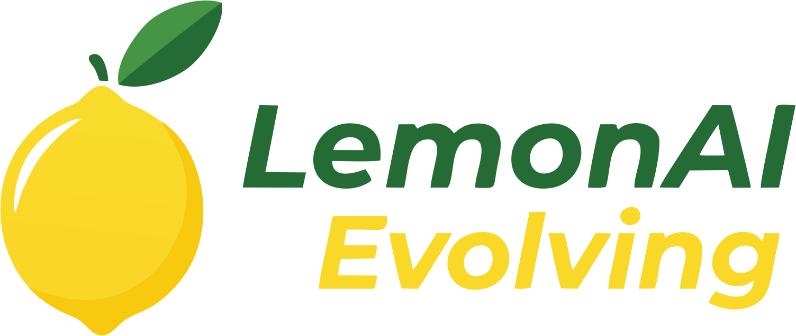
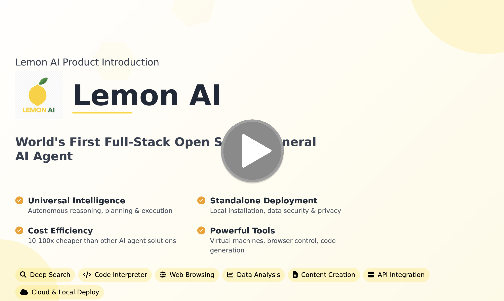
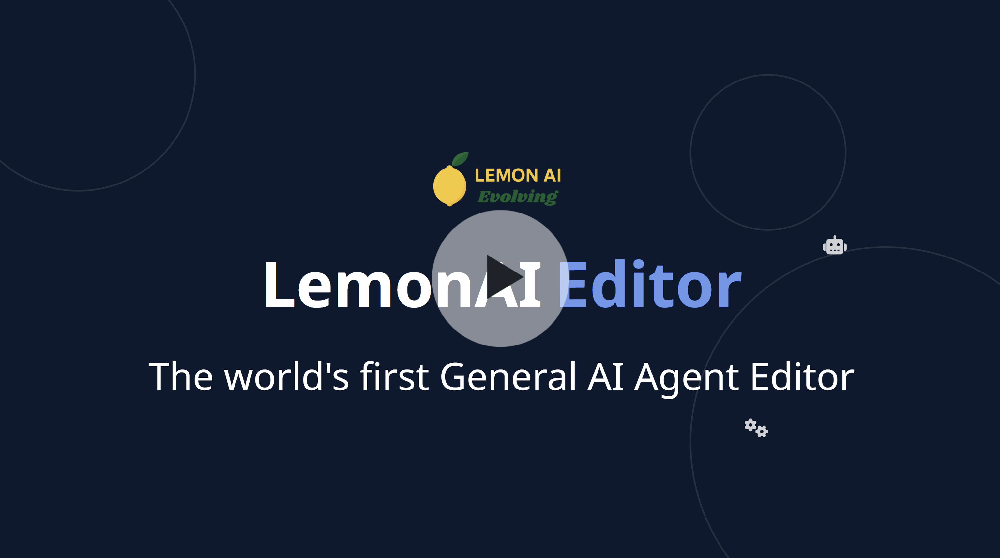

# Lemon AI是全球首个全栈开源自进化通用AI智能体,提供完全本地化的替代方案,可替代Manus和Genspark AI等智能体平台。它配备集成的代码解释器虚拟机沙箱,可安全执行代码。

<br><br>
<div align=center>
  
</div>
<br><br>
<p align="center">
  <a href="https://lemon-11.gitbook.io/lemonai/lemon-docs">快速了解 Lemon AI</a> ·
  <a href="https://lemon-11.gitbook.io/lemonai/lemon-docs/kai-fa-bu-shu-zhi-nan/docker-kuai-su-bu-shu">Docker快速部署</a> ·
  <a href="https://lemon-11.gitbook.io/lemonai/lemon-docs">文档</a> ·
  <a href="https://www.lemonai.cc">访问官网</a> ·
  <a href="https://deepwiki.com/hexdocom/lemonai">DeepWiki</a> 
</p>

<p align="center">
  <a href="./README.md"></a>
  <a href="./README_CN.md"></a>
</p>

Lemon AI是全球首个全栈开源自进化通用AI智能体,提供完全本地化的替代方案,可替代Manus和Genspark AI等智能体平台。它配备集成的代码解释器虚拟机沙箱,可安全执行代码。

Lemon AI支持深度研究、网页浏览、可行性编码和数据分析——完全在您的本地硬件上运行。它通过Ollama、VLLM支持使用本地大语言模型(如DeepSeek、Kimi、Qwen、Llama、Gemma、GPTOSS)实现规划、行动、反思和记忆功能,确保完全隐私保护和零云端依赖。

为增强安全性,Lemon AI通过Docker在本地虚拟机(VM)沙箱内运行。该沙箱通过安全地处理所有代码编写、执行和编辑任务,保护您机器的文件和操作系统。

此外,Lemon AI还提供灵活配置功能,可使用Claude、GPT、Gemini和Grok等领先云端模型的API来增强结果效果。

<a href="https://youtu.be/OmU_4rrZUHE?si=iseqOl5TV2n2kovy">
  <figure>
    
  </figure>
</a>

### 功能与特点

**全球第⼀款全栈开源的 AI Agentic 框架，多快好省，满⾜各类需求**

#### 多：无限多可能，无限多场景 
Lemon AI作为支持无限任务场景的通用 AI Agent 能力，包括：
- 深度搜索与研究报告  
- 代码生成与数据分析  
- 内容创作与文档处理  
- 支持经验库自学习及扩展企业定制化功能

#### 自我进化
为每一次对话建立专属记忆，让 Agent 随着使用变得越来越聪明、越来越贴合你的需求。

#### AI Agent HTML 编辑器
你只需点击任意 HTML 元素，就能由 AI Agent 直接修改它，无需每次都重新生成整份 HTML 文件。可以不断调整，直到你完全满意为止。


**部署方式：** 开源代码、容器、客户端应用、在线订阅 —— 兼容云端/本地/一体化系统  

#### 快：极速部署，即刻上手  
一键部署，无需复杂配置即可立即使用：
- 所有部署方式均简化安装流程  
- 无需复杂配置即可快速搭建  
- 5分钟内即可使用的系统  
- 支持从个人电脑到企业服务器的各种部署环境，配备完整文档以确保顺利实施  

#### 好：功能强大，灵活可定制
功能强大的框架，具备广泛的能力：
- 虚拟机集成  
- 代码生成与执行  
- 浏览器操作与网页搜索  
- 多工具集成  
- 高度可扩展架构，支持根据特定业务需求进行定制修改和扩展，并可与现有系统无缝集成  

#### 省：同等质量，成本降低10倍 
显著降低运营成本：
- 与其他AI Agent产品相比，Lemon AI的单次任务成本可降低10倍以上  
- 开源订阅模式  
- 基于开源 DeepSeekV3 模型  
- 在不牺牲质量和性能的前提下大幅节省成本，使各类规模组织都能轻松获取先进的 AI 能力

### Lemon AI Editor

**全球首款通用AI智能体编辑器---Lemon AI Editor**

#### 为什么我们需要一个通用AI智能体编辑器？

当你使用智能体创建研究报告、Vibe编程或生成数据分析图表时，结果往往并不完美。而当你试图修复某一部分时，其余部分可能会变得混乱。我们真正需要的是人类与AI之间的无缝协作。Lemon AI编辑器让你能够根据需要多次优化所有这些结果，直到你完全满意为止。你可以一遍又一遍地反复编辑。

#### 功能和特点

Lemon AI Editor 功能支持对生成的HTML页面进行持续编辑、修改、完善，所见即所得，所点即可改。

1.AI 编辑模式：

 - 让AI修改页面中任意板块内容

 - 让AI插入全新段落或内容

 - 让AI重新格式化整个页面

2.高级编辑模式：直接编辑，快速人工调整文本。

<a href="https://youtu.be/XaU4Vnt1lTI?si=iQJRSAaiUcqaN45k">
  <figure>
    
  </figure>
</a>

### 使用 Lemon AI

* 使用这个[入门指南](https://lemon-11.gitbook.io/lemon-docs)快速在您的环境中运行 Lemon AI。更多参考和详细说明请参阅我们的文档。

### 运行 Lemon AI

#### 系统要求 <a href="#system-requirements" id="system-requirements"></a>

* [支持 Docker Desktop](https://docs.docker.com/desktop/setup/install/mac-install/#system-requirements)的 MacOS
* Linux
* [支持WSL](https://learn.microsoft.com/en-us/windows/wsl/install)和[Docker Desktop 的](https://docs.docker.com/desktop/setup/install/windows-install/#system-requirements)Windows

建议使用具有现代处理器和至少**4GB RAM的系统来运行 Lemon AI。**

#### **MacOS**

**Docker 桌面**

1.  [在 Mac 上安装 Docker Desktop](https://docs.docker.com/desktop/setup/install/mac-install)。
2.  打开 Docker Desktop，转到`Settings > Advanced`并确保`Allow the default Docker socket to be used`已启用。

#### **Linux**

使用 Ubuntu 22.04 测试。

**Docker 桌面**

1.  [在 Linux 上安装 Docker Desktop](https://docs.docker.com/desktop/setup/install/linux/)。

#### **Windows**

**WSL**

1.  [安装 WSL](https://learn.microsoft.com/en-us/windows/wsl/install)。
2.  `wsl --version`在 powershell 中运行并确认`Default Version: 2`。

**Docker 桌面**

1.  [在 Windows 上安装 Docker Desktop](https://docs.docker.com/desktop/setup/install/windows-install)。
2.  打开Docker Desktop，前往`Settings`并确认以下内容：

    * 常规：`Use the WSL 2 based engine`已启用。
    * 资源 > WSL 集成：`Enable integration with my default WSL distro`已启用。

必须在 WSL 终端内运行以下用于启动应用程序的 docker 命令。

### 启动应用程序 <a href="#start-the-app" id="start-the-app"></a>

运行Lemon AI最简单的方法是使用 Docker。

```bash
docker pull hexdolemonai/lemon-runtime-sandbox:latest

docker run -it --rm --pull=always \
  --name lemon-app \
  --env DOCKER_HOST_ADDR=host.docker.internal \
  --env ACTUAL_HOST_WORKSPACE_PATH=${WORKSPACE_BASE:-$PWD/workspace} \
  --publish 5005:5005 \
  --add-host host.docker.internal:host-gateway \
  --volume /var/run/docker.sock:/var/run/docker.sock \
  --volume ~/.cache:/.cache \
  --volume ${WORKSPACE_BASE:-$PWD/workspace}:/workspace \
  --volume ${WORKSPACE_BASE:-$PWD/data}:/app/data \
  --interactive \
  --tty \
  hexdolemonai/lemon:latest make run
```

### 贡献

对于那些想要贡献代码的人，请参阅我们的[贡献指南](https://github.com/hexdocom/lemon/blob/main/CONTRIBUTING_CN.md)。同时，请考虑通过社交媒体、活动和会议来支持 Lemon AI 的分享。

#### 贡献者

<a href="https://github.com/hexdocom/lemonai/graphs/contributors">
  
</a>


### 社区与支持

我们欢迎您为 Lemon AI 作出贡献，以帮助改善 Lemon AI。包括：提交代码、问题、新想法，或分享您基于 Lemon AI创建的有趣且有用的 AI 应用程序。同时，我们也欢迎您在不同的活动、会议和社交媒体上分享 Lemon AI。

* [GitHub Discussion](https://github.com/hexdocom/lemonai/discussions). 👉：分享您的应用程序并与社区交流。
* [GitHub Issues](https://github.com/hexdocom/lemon/issues)。👉：使用 Lemon AI 时遇到的错误和问题，请参阅贡献指南
* 电子邮件支持👉：关于使用 Lemon的问题。
* [X(Twitter)](https://x.com/LemonAI_cc)。👉：分享您的应用程序并与社区交流。
* [Discord](https://discord.com/invite/gjEXg4UBR4)。👉：分享您的应用程序并与社区交流。
* 商业许可。👉：有关商业用途许可发送邮件至feedback@lemonai.cc进行Lemon AI的商业咨询。

### Star History

[](https://www.star-history.com/#hexdocom/lemonai&Date)

### 安全问题

为了保护您的隐私，请避免在 GitHub 上发布安全问题。发送问题至feedback@lemonai.cc我们将为您做更进一步的解答。

### 执照

本仓库遵循Lemon AI Open Source License 协议开源，该许可证本质上是Apache 2.0，但有一些额外的限制。
