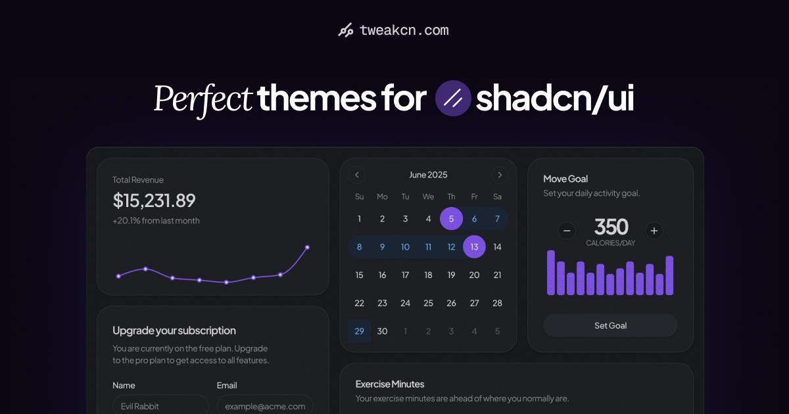

<div align="center">
  <h1>tweakcn.com</h1>
</div>

<div align="center">
  <a href="https://vercel.com/oss">
    
  </a>
  <br />
  <br />
  <a href="https://discord.gg/Phs4u2NM3n" target="_blank">
    
  </a>
  
  <a href="https://x.com/iamsahaj_xyz">
    
  </a>
</div>

<br />

**[tweakcn](https://tweakcn.com)** is a powerful Visual Theme Editor for tailwind CSS & shadcn/ui components. It comes with Beautiful theme presets to get started, while aiming to offer advanced customisation for each aspect of your UI



## Motivation

Websites made with shadcn/ui famously look the same. tweakcn is a tool that helps you customize shadcn/ui components visually, to make your components stand-out. The goal is to build a platform where a user can discover endless customization options and then have the ability to put their own twist on it. Check our roadmap for more information

## Current Features

You can find the full feature list here: https://tweakcn.com/#features

## Roadmap

You can find the updated roadmap here: https://tweakcn.com/#roadmap

## Run Locally

**IMPORTANT: For contributions, please see [CONTRIBUTING.md](CONTRIBUTING.md).**

### Prerequisites

- Node.js 18+
- npm / yarn / pnpm

### Installation

1. Clone the repository:

```bash
git clone https://github.com/jnsahaj/tweakcn.git
cd tweakcn
```

2. Install dependencies:

```bash
npm install
```

3. Start the development server:

```bash
npm run dev
```

4. Open [http://localhost:3000](http://localhost:3000) in your browser.

## Contributors

<a href="https://github.com/jnsahaj/tweakcn/graphs/contributors">
  
</a>

Made with [contrib.rocks](https://contrib.rocks).

### Interested in Contributing?

Contributions are welcome! Please feel free to submit a Pull Request.

# Star History

<p align="center">
  <a target="_blank" href="https://star-history.com/#jnsahaj/tweakcn&Date">
    <picture>
      <source media="(prefers-color-scheme: dark)" srcset="https://api.star-history.com/svg?repos=jnsahaj/tweakcn&type=Date&theme=dark">
      
    </picture>
  </a>
</p>

<!-- GitAds-Verify: HX84XPI5OQ816367AROGJ9SROARUHQER -->
